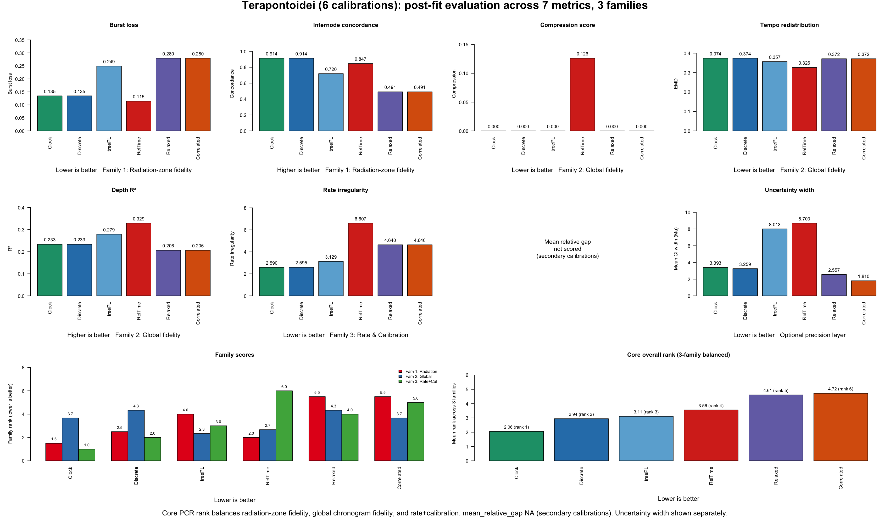
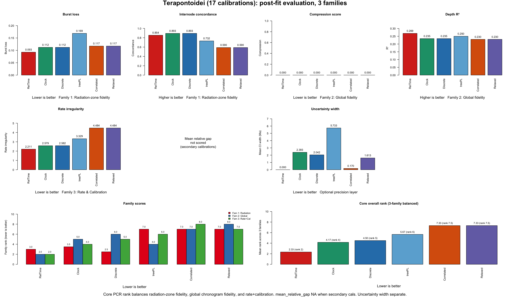
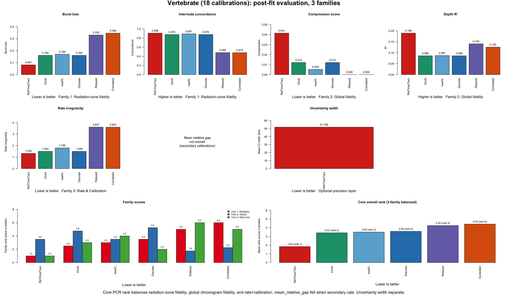
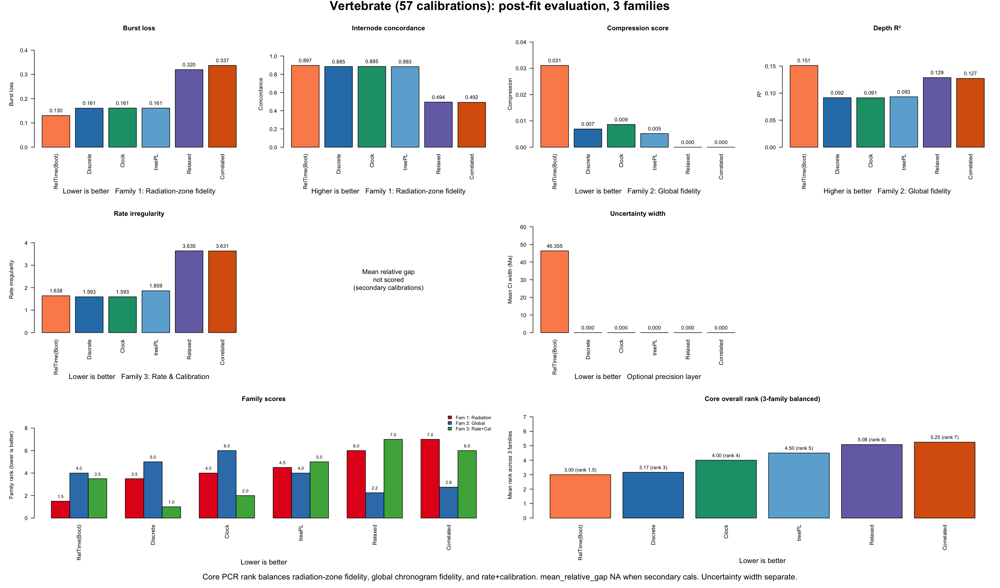
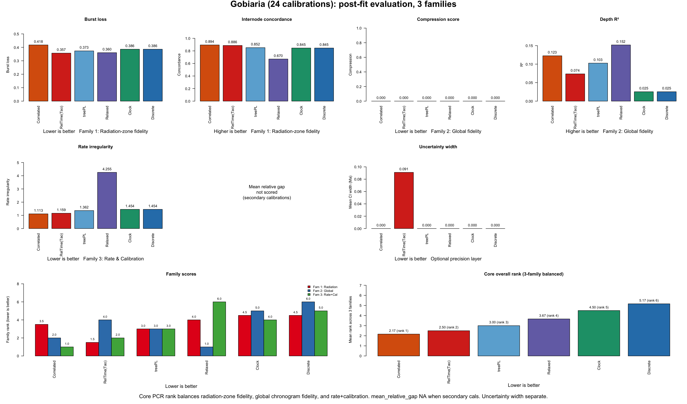
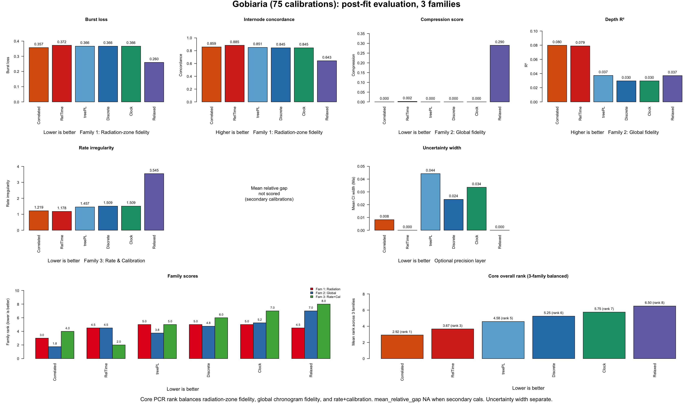
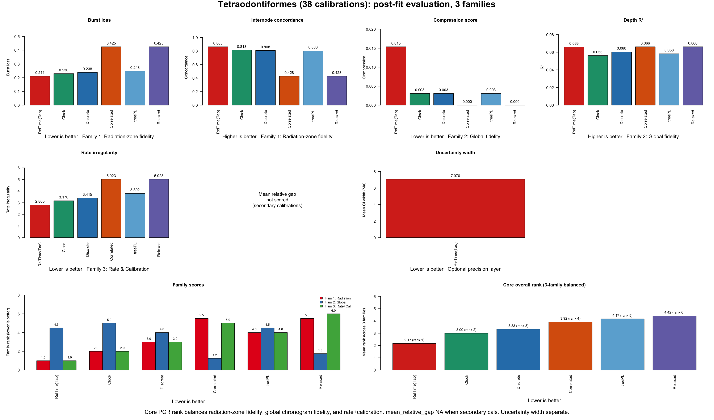
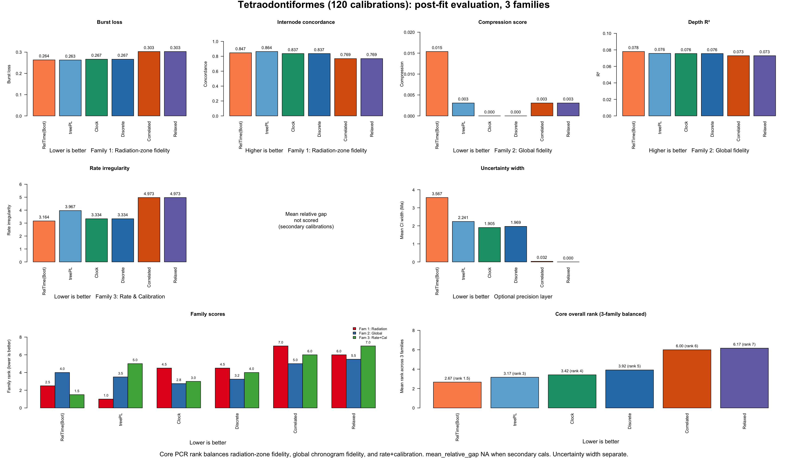

# PCR Postfit Metrics

`PCR Postfit Metrics` is a post-fit evaluation framework for phylogeneticists who already have a set of competing chronograms and need to decide which one is the most biologically defensible.

In simple terms, the core idea is that divergence-time estimation is hard: the resulting chronogram can shift substantially with clock-model choice, tree priors, calibration priors, and other analytical decisions ([Lepage et al. 2007](https://doi.org/10.1093/molbev/msm193); [dos Reis et al. 2016](https://doi.org/10.1038/nrg.2015.8); [Bromham et al. 2018](https://doi.org/10.1111/brv.12390)). A practical response is to compare a defensible set of alternative chronograms after they have been estimated, rather than betting everything on a single, computationally intensive "gold-standard" analysis and then treating that one tree as settled.

It is method-agnostic. The candidates can come from `BEAST`, `MCMCTree`, `MrBayes`, `chronos`, `treePL`, `RelTime`, or any other dating workflow.

PCR starts from finished chronograms. If you need to generate a set of chronograms from three alternative methods (`chronos`, `treePL`, `RelTime`) using an unconstrained phylogram and a calibration set, you can do that here: [PCR Custom Dating Pipeline From Phylograms](../1_PCR_CUSTOM_DATING_PIPELINE_FROM_PHYLOGRAMS/README.md).

## What it evaluates

`PhyloChronoRank (PCR)` uses three core metric families grouped by scope, what part of the tree they evaluate:

- **Family 1** evaluates radiation zones (cladogenetic bursts)
- **Family 2** evaluates global tree structure outside bursts
- **Family 3** evaluates the dating method's parametric behavior (rates and calibration fit)

Within each family, per-metric ranks are averaged; across families, the three family averages are averaged. This ensures no single scope dominates regardless of metric count per family. These are implementation-level diagnostics rather than named published indices; the citations below support the underlying biological ideas each family is trying to capture. All PCR scores are oriented so that lower is better. Ties use `average` ranking to preserve the rank-sum invariant. When all candidates produce the same raw value on a metric (zero variance), that metric is excluded via `NA` so it cannot dilute discriminatory metrics.

### Family 1 — Radiation-Zone Fidelity (1/3)

**Metrics:** `burst_loss`, `internode_concordance`

This family asks whether a dated tree keeps the same branching rhythm seen in the source phylogram within rapid radiations. In practice, this means preserving the clustered speciation bursts (short internodes packed together) instead of smearing them into evenly spaced splits.

The biological motivation is that substitution-rate bursts associated with speciation events are well documented: [Pagel et al. (2006)](https://doi.org/10.1126/science.1129647) showed that a large fraction of molecular divergence accumulates in punctuational bursts at cladogenesis rather than gradually along branches. The RCS (Relaxed Clock with Spikes) model formalizes this, showing that punctuated molecular evolution is detectable and should be preserved by dating methods ([Manceau et al. 2020](https://doi.org/10.1093/molbev/msaa144)). [Duchêne et al. (2022)](https://doi.org/10.1186/s12862-022-02024-5) showed that standard relaxed-clock models can fail to recover correct divergence times when molecular evolution is punctuated rather than gradual, exactly the failure mode these metrics are designed to catch.

- `burst_loss`: How much of the radiation-burst signal is destroyed during dating. If the phylogram shows tightly clustered speciation events (short internodes packed together, separated by longer quiet intervals) and the chronogram smears them into evenly spaced splits, the penalty is high. This measures loss of temporal clustering (the CV of inter-event spacing drops), not branch collapse to zero.

- `internode_concordance`: Whether the variability of internal branch lengths within each radiation zone is preserved. Within a radiation zone, the phylogram might show a mix of very short and moderately short internodes (high CV); a good chronogram should maintain that same spread rather than making all internodes uniformly equal (low CV). This complements `burst_loss`: burst_loss measures whether the temporal clustering of node depths is smeared out, while internode_concordance measures whether the spread of individual branch lengths within the zone is preserved. Empirically, the two metrics share only ~15% of variance across datasets and can rank candidates in opposite directions (e.g., Gobiaria), confirming they capture different aspects of radiation-zone fidelity.

### Family 2 — Global Chronogram Fidelity (1/3)

**Metrics:** `compression_score`, `depth_r2`

Outside radiation zones, the backbone of the tree (the deep splits and the overall pacing of divergence events) should be largely preserved from phylogram to chronogram, modulated by rate variation. Different relaxed-clock models accommodate rate heterogeneity in different ways ([Lartillot et al. 2016](https://doi.org/10.1098/rstb.2015.0132); [Lepage et al. 2007](https://doi.org/10.1093/molbev/msm193)), and model choice directly affects how faithfully backbone timing is recovered. This family checks whether the dating method introduced global distortions.

- `compression_score`: Detects places where the chronogram collapses well-separated phylogram branches into near-simultaneous splits that were not in the original tree. This flags artificial compression, a known artifact where prior specifications and clock model choices can systematically distort branch lengths ([Bromham et al. 2018](https://doi.org/10.1111/brv.12390)). A recurrent issue with some dating methods, particularly `RelTime`, where genuine divergence events get squeezed into near-polytomies.

- `depth_r2`: Overall correlation between node depths in the phylogram and chronogram. A high R² means the chronogram largely respects the relative ordering and spacing of divergence events encoded in the phylogram. Under realistic rate variation this will not be perfect, but a good dating method should not scramble the depth structure.

### Family 3 — Rate & Calibration (1/3)

**Metrics:** `rate_irregularity`, `mean_relative_gap`

For each branch, dividing the phylogram branch length (substitutions) by the chronogram branch duration (time) gives an implied evolutionary rate. This family evaluates whether those implied rates are biologically plausible and whether the chronogram respects its calibration constraints. Rate estimation and calibration fit are the two fundamental axes along which dating methods can fail independently of tree topology ([dos Reis et al. 2016](https://doi.org/10.1038/nrg.2015.8); [Ho & Duchêne 2014](https://doi.org/10.1111/mec.12953)).

- `rate_irregularity`: The score rises when implied rates are too dispersed, jump sharply from parent to child branch, produce too many outlier branches, or lose the positive autocorrelation expected among closely related lineages. This follows the penalized-likelihood and relaxed-clock literature on among-lineage rate variation and autocorrelation ([Sanderson 2002](https://doi.org/10.1093/oxfordjournals.molbev.a003974); [Lepage et al. 2007](https://doi.org/10.1093/molbev/msm193); [Ho & Duchêne 2014](https://doi.org/10.1111/mec.12953)). The metric penalizes erratic, unpatterned rate jumps that suggest overfitting or poor convergence rather than genuine biological rate heterogeneity.

- `mean_relative_gap`: For non-fixed calibration constraints (ranges, not point calibrations), measures how far estimated node ages sit from calibration interval boundaries relative to interval width. A chronogram that places calibrated nodes right at the edge of their prior ranges may be "rail-riding," constrained by the prior rather than informed by the data ([Szöllősi et al. 2022](https://doi.org/10.1093/sysbio/syab084)). This is the same general idea as ghost-lineage and stratigraphic-congruence measures ([Huelsenbeck 1994](https://doi.org/10.1017/S009483730001294X); [Wills 1999](https://doi.org/10.1080/106351599260148)). It should be interpreted carefully: fossils usually provide minimum ages, not true lineage origins, so a tree that minimizes this too aggressively can simply be too young overall ([Parham et al. 2012](https://doi.org/10.1093/sysbio/syr107)). `NA` when all calibrations are fixed, in which case it drops from Family 3.

### Uncertainty Width (Optional Precision Layer)

Measures how wide the confidence or credible intervals are around estimated node ages. Narrower intervals indicate greater precision, though precision and accuracy are distinct properties. Frequentist confidence intervals and Bayesian credibility intervals arise from different statistical frameworks and are not directly commensurable ([Paradis et al. 2023](https://doi.org/10.1016/j.ympev.2022.107652); [Drummond et al. 2006](https://doi.org/10.1371/journal.pbio.0040088); [Bromham 2019](https://doi.org/10.1016/j.tree.2019.01.017); [Tao et al. 2020a](https://academic.oup.com/mbe/article/37/1/280/5602325); [Tao et al. 2020b](https://academic.oup.com/mbe/article/37/6/1819/5771370)), so they are usually reported side by side rather than collapsed into one score ([Costa et al. 2022](https://bmcgenomics.biomedcentral.com/articles/10.1186/s12864-022-09030-5); [Beavan et al. 2020](https://academic.oup.com/gbe/article/12/7/1087/5842139)). PhyloChronoRank scores this layer only when intervals derive from comparable methodology across candidates. The analytical delta-method `RelTime` CI of [Tao et al. 2020a](https://academic.oup.com/mbe/article/37/1/280/5602325) is kept as a supplemental diagnostic because it can diverge sharply from bootstrap widths after bound projection.

### Scoring Procedure

1. Rank candidates per metric (lower = better, except `internode_concordance` and `depth_r2` where higher = better).
2. Zero-variance exclusion: if all candidates tie on a metric, it carries no discriminatory power and is set to `NA`.
3. Average ranks within each family (`na.rm = TRUE`).
4. Average the three family scores for the final composite rank.

<details>
<summary><strong>Compact formulas used in the current implementation</strong></summary>

#### Family 1

`burst_loss`

```text
burstiness = sd(inter-event waits) / mean(inter-event waits)   # CV of spacing
burst_loss_clade = max(0, (burstiness_ref - burstiness_est) / (burstiness_ref + 1e-12))
mean_burst_loss = weighted mean across matched radiation-zone clades
weight_clade = log(1 + n_tips) * sqrt(n_events)
```

What it means: how much temporal clustering was smeared away in each matched radiation zone. A burstiness CV near 1 or above means events are tightly clustered with quiet gaps between clusters; a CV near 0 means events are evenly spaced. `burst_loss` measures the fractional drop in that CV. Larger and more event-rich zones are given more weight.

`internode_concordance`

```text
cv_ref = internode CV in the reference phylogram subclade
cv_est = internode CV in the candidate chronogram subclade
concordance = min(cv_ref, cv_est) / max(cv_ref, cv_est)
internode_concordance = mean(concordance) across matched radiation zones
```

What it means: a ratio near 1 means the chronogram preserves the same coefficient of variation of internal branch lengths as the phylogram within each radiation zone. A low concordance value means the dating method changed how variable the internodes are, typically making them more uniform. This differs from `burst_loss`, which operates on cumulative node-depth gaps rather than individual branch lengths; the two share only ~15% of variance empirically.

#### Family 2

`compression_score`

```text
est_near_zero = 0.1% of chronogram total depth
ref_short_threshold = 5th percentile of phylogram internal branch lengths
compressed = branches where chronogram_bl <= est_near_zero AND phylogram_bl > ref_short_threshold
compression_score = n_compressed / n_total_matched_internal
```

What it means: fraction of internal branches that the chronogram collapsed to near-zero length even though the phylogram shows non-trivial branch lengths there. Higher = more artificial compression.

`depth_r2`

```text
Match all internal nodes between phylogram and chronogram by tip-set signature.
Normalize depths to [0, 1] within each tree.
depth_r2 = R² from lm(chronogram_depth ~ phylogram_depth)
```

What it means: overall goodness-of-fit between relative node depths. Higher R² = the chronogram respects the phylogram's depth structure.

#### Family 3

`rate_irregularity`

```text
branch_rate = phylogram_branch_length / chronogram_branch_duration
log_rate_sd = sd(log(branch_rate))
parent_child_jump = mean(|log(child_rate) - log(parent_rate)|)
extreme_rate_frac = fraction of branches with log(rate) outside 1.5 * IQR of log-rates
autocorr_penalty = 1 - max(Spearman_rho(parent_rate, child_rate), 0)
rate_irregularity = log_rate_sd + parent_child_jump + 2 * extreme_rate_frac + autocorr_penalty
```

What it means: the score rises when branchwise rates are more dispersed, jump more sharply from parent to child, produce more extreme outlier branches, or lose positive autocorrelation. The autocorrelation component is important because well-behaved relaxed clocks produce rates that are correlated between adjacent branches; a dating method that creates erratic parent-child rate jumps is likely imposing node placements that conflict with the molecular signal.

`mean_relative_gap`

```text
For each non-fixed (window) calibration:
  ghost_gap = node_age - age_min
  relative_gap = ghost_gap / age_min
mean_relative_gap = mean(relative_gap) across non-fixed calibrations only
```

What it means: the average amount of extra inferred lineage history beyond the calibration minima, scaled by the minimum ages. Fixed (point) calibrations are excluded because there is no window to evaluate. With secondary or congruified ages, report it separately as calibration slack or omit it from the core rank.

#### Overall scoring

```text
family_radiation = mean(rank_burst_loss, rank_internode_concordance)
family_global = mean(rank_compression_score, rank_depth_r2)
family_ratecal = mean(rank_rate_irregularity, rank_mean_relative_gap)
overall_rank = mean(family_radiation, family_global, family_ratecal)
```

What it means: each family contributes exactly `1/3` of the final rank. Within each family, metrics contribute equally. If a metric is `NA` (zero variance or not computable), it drops from its family average. If an entire family is `NA`, the overall score averages across the remaining families.

</details>

## Run PCR on your own data

`PhyloChronoRank (PCR)` includes a standalone runner:

- `scripts/run_pcr.R`

At minimum, it expects:

- one reference phylogram
- one candidate manifest with `candidate,tree_file`

Optional:

- `--calibrations-csv` when you want PCR to score the calibration-fit / gap layer
- `--uncertainty-csv` when you want to report the optional precision layer from a separate interval-width table

If you do not provide `--uncertainty-csv`, PCR will still try to extract interval widths directly from annotated Newick trees.

Example commands:

```bash
Rscript scripts/run_pcr.R \
  --ref-tree=examples/terapontoid/Terapontoid_ML_MAIN_phylogram_used.tree \
  --candidates-csv=examples/terapontoid/candidates.csv \
  --outdir=out/terapontoid
```

```bash
Rscript scripts/run_pcr.R \
  --ref-tree=examples/syngnatharia/backbone_Raxml_besttree_matrix75.tre \
  --candidates-csv=examples/syngnatharia/candidates.csv \
  --calibrations-csv=examples/syngnatharia/calibrations_by_candidate.csv \
  --uncertainty-csv=examples/syngnatharia/uncertainty_summary_long.csv \
  --outdir=out/syngnatharia
```

To validate the bundled examples and the displayed README tables, run:

```bash
Rscript scripts/validate_examples.R
```

## Example 1: Empirical dataset with two competing chronograms (Syngnatharia)

### Visual choice before metrics

This example is different. It does not start from a `chronos` fit search. It starts from an earlier visual comparison among the `RAxML` phylogram, `MCMCTree`, and `RelTime`. In that original comparison, the practical choice was to favor `RelTime` because it visually preserved the diversification bursts in the phylogram better than `MCMCTree`, as discussed in [Santaquiteria et al. 2024](https://www.journals.uchicago.edu/doi/10.1086/733931).

That is the key point of this first example: the choice to prefer `RelTime` came first as a visual judgment. The post-fit metrics quantify that visual rationale.

### Quick takeaway

- `RelTime` is the core PCR winner in this comparison (1.17 vs 1.83)
- `RelTime` wins Family 1 (radiation-zone fidelity): better `burst_loss` and `internode_concordance`
- Family 2 (global chronogram fidelity): `compression_score` is zero for both (excluded as zero-variance), so Family 2 = `depth_r2` only; `RelTime` wins (higher R²)
- Family 3 (rate & calibration) is tied: `RelTime` wins `rate_irregularity`, `MCMCTree` wins `mean_relative_gap`
- `MCMCTree` also has narrower extracted HPD bars, so it wins the optional precision layer on interval width
- `Figure A` is the original visual rationale from the paper; `Figure B` is the quantitative post-fit follow-up

### Figure A: Original visual rationale from the paper


This is the original paper figure from [Santaquiteria et al. 2024](https://www.journals.uchicago.edu/doi/10.1086/733931) that motivated the visual preference for `RelTime`. The RAxML phylogram on the left shows clustered branching bursts in several parts of the tree. In the middle panel, `MCMCTree` spreads many of those events out more evenly through time. In the right panel, `RelTime` better tracks the burst structure seen in the phylogram. That was the original rationale back then. This panel addresses the radiation-zone fidelity issue only. It does not show the global fidelity, rate, or calibration layers.

### Ranked post-fit results (lower is better)

The core PCR rank is balanced across three families (radiation-zone fidelity, global chronogram fidelity, rate & calibration), each contributing one-third. Here the gap layer is informative because the comparison uses primary calibration information summarized from Table S2 rather than secondary congruified ages. The uncertainty-width layer is shown separately as an additional precision consideration, not folded into the core rank. The uncertainty widths are based on extracted HPD-width spreadsheets because the supplied Newick trees do not themselves contain embedded interval metadata.

| candidate | burst loss | internode concordance | compression score | depth R² | rate irregularity | mean relative gap | uncertainty width (Ma) | core rank |
| --- | ---: | ---: | ---: | ---: | ---: | ---: | ---: | ---: |
| `RelTime` | `0.162` | `0.925` | `0.000` | `0.114` | `1.151` | `0.269` | `11.41` | `1.17` |
| `MCMCTree` | `0.240` | `0.810` | `0.000` | `0.059` | `1.553` | `0.218` | `6.24` | `1.83` |

Family breakdown:

| candidate | Family 1 (radiation zone) | Family 2 (global) | Family 3 (rate + cal) | Core rank |
| --- | ---: | ---: | ---: | ---: |
| `RelTime` | `1.0` | `1.0` | `1.5` | `1.17` |
| `MCMCTree` | `2.0` | `2.0` | `1.5` | `1.83` |

### Figure B: Post-fit comparison across metric families


Figure B shows all six core metrics grouped by family, plus `uncertainty width` as a separate optional precision layer. `compression_score` is zero for both candidates (no artificial near-polytomies detected in either chronogram), so it is excluded from the Family 2 average via zero-variance exclusion.

The uncertainty-width separation is deliberate. The RelTime literature does not support a simple story that wider intervals are automatically worse. Instead, broader RelTime intervals are often discussed as a precision-versus-coverage tradeoff: the analytical confidence-interval procedure explicitly propagates branch-length uncertainty and rate heterogeneity, which can yield wider intervals that improve coverage while reducing precision ([Tao et al. 2020](https://academic.oup.com/mbe/article/37/1/280/5602325); [Costa et al. 2022](https://bmcgenomics.biomedcentral.com/articles/10.1186/s12864-022-09030-5); [Beavan et al. 2020](https://academic.oup.com/gbe/article/12/7/1087/5842139)). That is why PCR reports interval width separately rather than treating it as a fourth family.

### Interpretation for this example

- `RelTime` is the core PCR winner (1.17 vs 1.83)
- `RelTime` wins Family 1 (radiation-zone fidelity): it better preserves the burst structure and internode variability within radiation zones, consistent with the original visual rationale from Figure A
- `RelTime` wins Family 2 (global fidelity): `compression_score` is zero for both (excluded), and `RelTime` has a higher depth R² (0.114 vs 0.059)
- Family 3 (rate & calibration) is tied: `RelTime` wins `rate_irregularity` (lower rate dispersion and better parent-child rate autocorrelation), while `MCMCTree` wins `mean_relative_gap` (stays closer to calibration minima)
- `MCMCTree` also has narrower extracted HPD bars, so it wins the optional uncertainty-width layer
- The post-fit metrics support the original visual rationale from Figure A: `RelTime` better preserves the branching signal seen in the RAxML phylogram
- This is exactly the kind of case where a visual choice made before these metrics existed can now be quantified explicitly instead of being left as impression only

### Practical decision rule

1. If you want the core PCR winner focused on chronogram behavior, choose `RelTime`. It wins radiation-zone fidelity, global fidelity, and rate regularity.
2. If you care primarily about calibration fit and narrower interval estimates, `MCMCTree` wins `mean relative gap` and the optional uncertainty-width layer.
3. Report the tradeoff explicitly: `RelTime` is the better chronogram for structural fidelity and rate smoothness, while `MCMCTree` stays closer to calibration minima and has narrower intervals.
4. The original visual choice to favor `RelTime` ([Santaquiteria et al. 2024](https://www.journals.uchicago.edu/doi/10.1086/733931)) is supported quantitatively by the current post-fit framework.

<details>
<summary><strong>Files behind this example</strong></summary>

- `examples/syngnatharia/candidates.csv`
- `examples/syngnatharia/calibrations_by_candidate.csv`
- `examples/syngnatharia/backbone_Raxml_besttree_matrix75.tre`
- `examples/syngnatharia/CalibratedTree_backbone_MCMCTree_matrix75_RAXML.tre`
- `examples/syngnatharia/CalibratedTree_backbone_RelTime_matrix75_RAXML.tre`
- `examples/syngnatharia/Fig_S5_Burst_preservation.png`
- `examples/syngnatharia/syngnatharia_HPD_summary.csv`
- `examples/syngnatharia/syngnatharia_HPD_widths_extracted.csv`
- `examples/syngnatharia/uncertainty_summary_long.csv`
- `examples/syngnatharia/pcr_rerun_3fam/summary_pcr_metrics.csv`
- `figures/syngnatharia_postfit_metric_family_values.png`
- `scripts/run_pcr.R`
- `scripts/make_all_postfit_figures.R`

</details>

## Example 2: Terapontoidei — calibration density changes the winner

This example uses a 105-tip percomorph phylogeny (Terapontoidei) dated with six methods under two calibration schemes: a **sparse** set (6 congruified point calibrations) and a **dense** set (17 congruified point calibrations). Both schemes use secondary ages inherited from a reference timetree via congruification, not primary fossil calibrations. Because of this, `mean_relative_gap` is NA and drops from Family 3; rate irregularity alone carries that family.

Comparing the two schemes tests whether the PCR ranking is robust to calibration density, or whether adding more secondary constraints reshuffles the winners.

### Figure A: Pulse-layer tree-shape comparison among bundled chronos trees


This figure shows the pulse layer directly on alternative `chronos` trees (clock, discrete, correlated, relaxed). `treePL` and `RelTime` are not shown. It illustrates how different clock models handle radiation-zone branching patterns, but the quantitative PCR comparison below includes all six candidates.

### Scheme 1: Sparse calibrations (6 congruified ages, 6 candidates)

| candidate | burst loss | int. concordance | compression | depth R² | rate irregularity | Fam 1 | Fam 2 | Fam 3 | core rank |
| --- | ---: | ---: | ---: | ---: | ---: | ---: | ---: | ---: | ---: |
| `chronos_clock` | 0.135 | 0.914 | 0.000 | 0.233 | 2.590 | 1.5 | 3.0 | 1.0 | **1.83** |
| `chronos_discrete` | 0.135 | 0.914 | 0.000 | 0.233 | 2.595 | 2.5 | 3.5 | 2.0 | 2.67 |
| `treePL` | 0.249 | 0.720 | 0.000 | 0.279 | 3.129 | 4.0 | 2.5 | 3.0 | 3.17 |
| `RelTime` | 0.115 | 0.847 | 0.126 | 0.329 | 6.607 | 2.0 | 3.5 | 6.0 | 3.83 |
| `chronos_relaxed` | 0.280 | 0.491 | 0.000 | 0.207 | 4.640 | 5.5 | 4.5 | 4.0 | 4.67 |
| `chronos_correlated` | 0.280 | 0.491 | 0.000 | 0.207 | 4.640 | 5.5 | 4.0 | 5.0 | 4.83 |

**Winner: `chronos_clock` (1.83).** `chronos_clock` and `chronos_discrete` are nearly identical on every metric, differing only by rounding in rate irregularity (2.590 vs 2.595). `RelTime` has the best burst loss (0.115) and the best depth R² (0.329), but its rate irregularity is extreme (6.607), dragging it to 4th. `treePL` is a middle-tier candidate (3.17). The two non-clock `chronos` models (`relaxed`, `correlated`) are the weakest, with poor internode concordance (0.491) and high rate irregularity.

### Scheme 2: Dense calibrations (17 congruified ages, 6 unique candidates)

| candidate | burst loss | int. concordance | compression | depth R² | rate irregularity | Fam 1 | Fam 2 | Fam 3 | core rank |
| --- | ---: | ---: | ---: | ---: | ---: | ---: | ---: | ---: | ---: |
| `RelTime` | 0.093 | 0.854 | 0.000 | 0.269 | 2.211 | 3.0 | 2.0 | 2.0 | **2.33** |
| `chronos_clock` | 0.112 | 0.893 | 0.000 | 0.235 | 2.579 | 3.5 | 5.0 | 4.0 | 4.17 |
| `chronos_discrete` | 0.112 | 0.893 | 0.000 | 0.235 | 2.582 | 2.5 | 6.0 | 5.0 | 4.50 |
| `treePL` | 0.169 | 0.732 | 0.000 | 0.250 | 3.329 | 7.0 | 4.0 | 6.0 | 5.67 |
| `chronos_correlated` | 0.117 | 0.590 | 0.000 | 0.230 | 4.484 | 7.0 | 7.0 | 8.0 | 7.33 |
| `chronos_relaxed` | 0.117 | 0.590 | 0.000 | 0.230 | 4.484 | 7.0 | 8.0 | 7.0 | 7.33 |

Note: three identical `RelTime_MEGA` entries (differing only in CI method) are collapsed to one row here. Ranks in the original output reflect the full 8-candidate field.

**Winner: `RelTime` (2.33).** The key shift is rate irregularity: `RelTime` drops from 6.607 (6 cals) to 2.211 (17 cals), now the best in the field. With more calibration constraints anchoring the time axis, RelTime's implied branch rates become much smoother. Its burst loss (0.093) is also the best. `chronos_clock` is runner-up (4.17), still strong on internode concordance (0.893) but no longer dominant.

### Figure B: Post-fit comparison — sparse calibrations



### Figure C: Post-fit comparison — dense calibrations



### Why calibration density matters

Adding more secondary calibration points constrains the time axis more tightly, which directly affects rate irregularity. With only 6 calibrations, large uncalibrated regions of the tree are free to absorb rate variation unevenly; RelTime's approach of distributing substitutions without a tree prior amplifies this, producing erratic rate jumps (rate irregularity = 6.607). With 17 calibrations, those same regions are pinned by inherited ages, and RelTime's rate landscape smooths dramatically (2.211).

The radiation-zone and global-fidelity metrics are less sensitive to calibration density: burst loss and internode concordance change modestly between schemes, confirming that pulse-preservation is driven more by clock model architecture than by how many node ages are fixed.

This comparison illustrates a practical point: **when using secondary/congruified calibrations, the number of inherited ages is a tuning knob that can shift the winner.** Reporting results under both sparse and dense schemes is more informative than picking one.

### Interpretation

- With 6 calibrations, `chronos_clock` wins because it has the best rate behavior, and `RelTime` is penalized by extreme rate irregularity
- With 17 calibrations, `RelTime` wins because the additional constraints tame its rate landscape, and it already has the best radiation-zone preservation
- `chronos_discrete` is consistently the runner-up to `chronos_clock` in both schemes, nearly indistinguishable
- `chronos_correlated` and `chronos_relaxed` are the weakest candidates under both schemes
- `treePL` is a consistent mid-tier candidate
- `mean_relative_gap` is NA in both schemes because all calibrations are secondary/congruified ages inherited from a reference timetree, not primary fossil evidence

<details>
<summary><strong>Files behind this example</strong></summary>

- `examples/terapontoid/pcr_rerun_3fam/summary_pcr_metrics.csv` (6-calibration scheme)
- `5_DATASETS_MANY_CALS/terapontoidei/pcr_rerun_3fam_restored/summary_pcr_metrics.csv` (17-calibration scheme)
- `examples/terapontoid/Terapontoid_ML_MAIN_calibrations_used.csv` (congruified calibration ages; not scored in core PCR rank)
- the six candidate trees in `examples/terapontoid/`
- `figures/branching_tempo_tree_panel_clean_v3.png`
- `figures/terapontoid_postfit_FEW.png`
- `figures/terapontoid_postfit_MANY.png`
- `scripts/run_pcr.R`
- `scripts/make_all_postfit_figures.R`

</details>

## Example 3: Unpublished vertebrate dataset (581 tips)

This large phylogenomic dataset (581 tips, 113 radiation zones) compares six dating methods under sparse (18 congruified calibrations) and dense (57 congruified calibrations) schemes. All calibrations are secondary/congruified ages, so `mean_relative_gap` is NA and Family 3 = rate irregularity only. Raw trees and calibration table are withheld because the dataset is unpublished.

### Scheme 1: Sparse calibrations (18 congruified ages, 6 candidates)

| candidate | burst loss | int. concordance | compression | depth R² | rate irregularity | Fam 1 | Fam 2 | Fam 3 | core rank |
| --- | ---: | ---: | ---: | ---: | ---: | ---: | ---: | ---: | ---: |
| `RelTime` | 0.081 | 0.906 | 0.042 | 0.189 | 1.320 | 1.0 | 3.5 | 1.0 | **1.83** |
| `chronos_clock` | 0.160 | 0.876 | 0.012 | 0.086 | 1.500 | 2.5 | 4.75 | 3.0 | 3.42 |
| `treePL` | 0.169 | 0.891 | 0.005 | 0.087 | 1.795 | 3.0 | 3.5 | 4.0 | 3.50 |
| `chronos_discrete` | 0.160 | 0.876 | 0.012 | 0.086 | 1.499 | 3.5 | 5.25 | 2.0 | 3.58 |
| `chronos_relaxed` | 0.330 | 0.480 | 0.000 | 0.140 | 3.607 | 5.0 | 1.75 | 6.0 | 4.25 |
| `chronos_correlated` | 0.346 | 0.480 | 0.000 | 0.125 | 3.600 | 6.0 | 2.25 | 5.0 | 4.42 |

**Winner: `RelTime` (1.83).** RelTime dominates both radiation-zone preservation (burst loss = 0.081, best internode concordance = 0.906) and rate behavior (rate irregularity = 1.320), giving it the best Family 1 and Family 3 scores. Its Family 2 (global fidelity) is mid-range, but the 3-family balance still puts it clearly ahead. `chronos_clock` (3.42) and `treePL` (3.50) are close runners-up. The non-clock `chronos` models (`correlated`, `relaxed`) have good global fidelity (low compression) but terrible radiation-zone and rate scores.

### Scheme 2: Dense calibrations (57 congruified ages, 6 unique candidates)

| candidate | burst loss | int. concordance | compression | depth R² | rate irregularity | Fam 1 | Fam 2 | Fam 3 | core rank |
| --- | ---: | ---: | ---: | ---: | ---: | ---: | ---: | ---: | ---: |
| `RelTime` | 0.131 | 0.897 | 0.031 | 0.151 | 1.638 | 1.5 | 4.0 | 3.5 | **3.00** |
| `chronos_discrete` | 0.161 | 0.885 | 0.007 | 0.092 | 1.593 | 3.5 | 5.0 | 1.0 | 3.17 |
| `chronos_clock` | 0.161 | 0.885 | 0.009 | 0.091 | 1.593 | 4.0 | 6.0 | 2.0 | 4.00 |
| `treePL` | 0.161 | 0.883 | 0.005 | 0.093 | 1.859 | 4.5 | 4.0 | 5.0 | 4.50 |
| `chronos_relaxed` | 0.320 | 0.495 | 0.000 | 0.129 | 3.635 | 6.0 | 2.25 | 7.0 | 5.08 |
| `chronos_correlated` | 0.337 | 0.492 | 0.000 | 0.127 | 3.631 | 7.0 | 2.75 | 6.0 | 5.25 |

Note: two identical `RelTime` entries (differing only in CI method) are collapsed to one row.

**Winner: `RelTime` (3.00), with `chronos_discrete` a close second (3.17).** With 57 calibrations, the top-4 candidates compress into a tight range (3.00–4.50). `RelTime` wins through the best radiation-zone scores (burst loss = 0.131, internode concordance = 0.897). `chronos_discrete` has a slight edge on rate irregularity (1.593 vs 1.638). The correlated/relaxed pair remain at the bottom.

### Figure B: Vertebrate — sparse calibrations



### Figure C: Vertebrate — dense calibrations



### Interpretation

- With 18 calibrations, `RelTime` wins clearly (1.83) by dominating Families 1 and 3
- With 57 calibrations, `RelTime` still wins (3.00 vs 3.17) in a tighter field, with the top-4 separated by only 1.5 rank points
- The non-clock `chronos` models are consistently the weakest in both schemes, despite having good global fidelity (low compression). Their poor internode concordance (~0.48) and high rate irregularity (~3.6) sink them
- All calibrations are secondary/congruified; `mean_relative_gap` is NA

<details>
<summary><strong>Files behind this example</strong></summary>

- `5_DATASETS_FEW_CALS/vertebrate/pcr_rerun_3fam/summary_pcr_metrics.csv`
- `5_DATASETS_MANY_CALS/vertebrate/pcr_rerun_3fam/summary_pcr_metrics.csv`
- `figures/vertebrate_postfit_FEW.png`
- `figures/vertebrate_postfit_MANY.png`
- `scripts/run_pcr.R`
- `scripts/make_all_postfit_figures.R`

</details>

## Example 4: Unpublished Gobiaria dataset (495 tips)

This goby-dominated percomorph dataset (495 tips, 74 radiation zones) compares six methods under sparse (24 congruified calibrations) and dense (75 congruified calibrations) schemes. All calibrations are secondary/congruified, so `mean_relative_gap` is NA.

### Scheme 1: Sparse calibrations (24 congruified ages, 6 candidates)

| candidate | burst loss | int. concordance | compression | depth R² | rate irregularity | Fam 1 | Fam 2 | Fam 3 | core rank |
| --- | ---: | ---: | ---: | ---: | ---: | ---: | ---: | ---: | ---: |
| `chronos_correlated` | 0.418 | 0.895 | 0.000 | 0.123 | 1.113 | 3.5 | 2.0 | 1.0 | **2.17** |
| `RelTime` | 0.357 | 0.886 | 0.000 | 0.074 | 1.160 | 1.5 | 4.0 | 2.0 | 2.50 |
| `treePL` | 0.373 | 0.852 | 0.000 | 0.103 | 1.362 | 3.0 | 3.0 | 3.0 | 3.00 |
| `chronos_relaxed` | 0.360 | 0.670 | 0.000 | 0.152 | 4.255 | 4.0 | 1.0 | 6.0 | 3.67 |
| `chronos_clock` | 0.386 | 0.845 | 0.000 | 0.025 | 1.454 | 4.5 | 5.0 | 4.0 | 4.50 |
| `chronos_discrete` | 0.386 | 0.845 | 0.000 | 0.025 | 1.454 | 4.5 | 6.0 | 5.0 | 5.17 |

**Winner: `chronos_correlated` (2.17).** An unusual result: `chronos_correlated` wins here because it has the best rate irregularity (1.113) and a strong Family 2 score. In most other datasets, correlated models score poorly, but here the goby phylogeny seems to have enough rate autocorrelation structure that the correlated model fits well. `RelTime` is runner-up (2.50), with the best burst loss (0.357) but weaker global fidelity. Note that `chronos_relaxed` has excellent global fidelity (best depth R² = 0.152) but catastrophic rate irregularity (4.255).

### Scheme 2: Dense calibrations (75 congruified ages, 6 unique candidates)

| candidate | burst loss | int. concordance | compression | depth R² | rate irregularity | Fam 1 | Fam 2 | Fam 3 | core rank |
| --- | ---: | ---: | ---: | ---: | ---: | ---: | ---: | ---: | ---: |
| `chronos_correlated` | 0.357 | 0.859 | 0.000 | 0.080 | 1.219 | 3.0 | 1.75 | 4.0 | **2.92** |
| `RelTime` | 0.372 | 0.885 | 0.002 | 0.079 | 1.178 | 4.5 | 4.5 | 2.0 | 3.67 |
| `treePL` | 0.366 | 0.851 | 0.000 | 0.037 | 1.457 | 5.0 | 3.75 | 5.0 | 4.58 |
| `chronos_discrete` | 0.366 | 0.845 | 0.000 | 0.030 | 1.509 | 5.0 | 4.75 | 6.0 | 5.25 |
| `chronos_clock` | 0.366 | 0.845 | 0.000 | 0.030 | 1.509 | 5.0 | 5.25 | 7.0 | 5.75 |
| `chronos_relaxed` | 0.260 | 0.643 | 0.290 | 0.037 | 3.545 | 4.5 | 7.0 | 8.0 | 6.50 |

Note: three identical `RelTime` entries (differing only in CI method) are collapsed to one row. Ranks reflect the full 8-candidate field.

**Winner: `chronos_correlated` again (2.92).** Gobiaria is the one dataset where `chronos_correlated` consistently leads. With 75 calibrations, it retains the best global fidelity balance and still-competitive rate behavior. `RelTime` is again runner-up (3.67) with the best internode concordance (0.885) and rate irregularity (1.178). `chronos_relaxed` collapses under dense calibrations, developing high compression (0.290) and poor rate behavior (3.545).

### Figure B: Gobiaria — sparse calibrations



### Figure C: Gobiaria — dense calibrations



### Interpretation

- `chronos_correlated` wins under both calibration densities, the only dataset where a non-clock `chronos` model leads
- This likely reflects genuine rate autocorrelation in gobies: closely related lineages evolve at similar rates, so the correlated model fits the data well rather than distorting it
- `chronos_relaxed` has a split personality: excellent global fidelity with sparse cals, catastrophic performance with dense cals (compression score jumps to 0.290)
- `chronos_clock` and `chronos_discrete` are consistently mid-tier here, unlike their strong performance in other datasets
- All calibrations are secondary/congruified; `mean_relative_gap` is NA

<details>
<summary><strong>Files behind this example</strong></summary>

- `5_DATASETS_FEW_CALS/gobiaria/pcr_rerun_3fam/summary_pcr_metrics.csv`
- `5_DATASETS_MANY_CALS/gobiaria/pcr_rerun_3fam/summary_pcr_metrics.csv`
- `figures/gobiaria_postfit_FEW.png`
- `figures/gobiaria_postfit_MANY.png`
- `scripts/run_pcr.R`
- `scripts/make_all_postfit_figures.R`

</details>

## Example 5: Unpublished Tetraodontiformes dataset (327 tips)

This pufferfish-dominated dataset (327 tips, 47 radiation zones) compares six methods under sparse (38 congruified calibrations) and dense (120 congruified calibrations) schemes. All calibrations are secondary/congruified, so `mean_relative_gap` is NA.

### Scheme 1: Sparse calibrations (38 congruified ages, 6 candidates)

| candidate | burst loss | int. concordance | compression | depth R² | rate irregularity | Fam 1 | Fam 2 | Fam 3 | core rank |
| --- | ---: | ---: | ---: | ---: | ---: | ---: | ---: | ---: | ---: |
| `RelTime` | 0.211 | 0.863 | 0.015 | 0.066 | 2.805 | 1.0 | 4.5 | 1.0 | **2.17** |
| `chronos_clock` | 0.230 | 0.813 | 0.003 | 0.056 | 3.171 | 2.0 | 5.0 | 2.0 | 3.00 |
| `chronos_discrete` | 0.238 | 0.808 | 0.003 | 0.060 | 3.415 | 3.0 | 4.0 | 3.0 | 3.33 |
| `chronos_correlated` | 0.425 | 0.428 | 0.000 | 0.066 | 5.023 | 5.5 | 1.25 | 5.0 | 3.92 |
| `treePL` | 0.248 | 0.803 | 0.003 | 0.058 | 3.802 | 4.0 | 4.5 | 4.0 | 4.17 |
| `chronos_relaxed` | 0.425 | 0.428 | 0.000 | 0.066 | 5.023 | 5.5 | 1.75 | 6.0 | 4.42 |

**Winner: `RelTime` (2.17).** RelTime has the best burst loss (0.211), best internode concordance (0.863), and best rate irregularity (2.805). Its only weakness is global fidelity (Family 2 = 4.5), where the correlated/relaxed pair dominate with low compression. `chronos_clock` (3.00) and `chronos_discrete` (3.33) are solid runners-up. The correlated/relaxed pair again show the split: great global fidelity but dismal radiation-zone concordance (0.428) and rate behavior (5.023).

### Scheme 2: Dense calibrations (120 congruified ages, 6 unique candidates)

| candidate | burst loss | int. concordance | compression | depth R² | rate irregularity | Fam 1 | Fam 2 | Fam 3 | core rank |
| --- | ---: | ---: | ---: | ---: | ---: | ---: | ---: | ---: | ---: |
| `RelTime` | 0.264 | 0.847 | 0.015 | 0.078 | 3.164 | 2.5 | 4.0 | 1.5 | **2.67** |
| `treePL` | 0.263 | 0.864 | 0.003 | 0.076 | 3.967 | 1.0 | 3.5 | 5.0 | 3.17 |
| `chronos_clock` | 0.267 | 0.837 | 0.000 | 0.076 | 3.334 | 4.5 | 2.75 | 3.0 | 3.42 |
| `chronos_discrete` | 0.267 | 0.837 | 0.000 | 0.076 | 3.334 | 4.5 | 3.25 | 4.0 | 3.92 |
| `chronos_correlated` | 0.303 | 0.769 | 0.003 | 0.073 | 4.973 | 7.0 | 5.0 | 6.0 | 6.00 |
| `chronos_relaxed` | 0.303 | 0.769 | 0.003 | 0.073 | 4.973 | 6.0 | 5.5 | 7.0 | 6.17 |

Note: two identical `RelTime` entries (differing only in CI method) are collapsed to one row. Ranks reflect the full 7-candidate field.

**Winner: `RelTime` again (2.67).** With 120 calibrations, RelTime retains the lead through the best rate irregularity (3.164) combined with strong radiation-zone scores. `treePL` climbs to a close second (3.17) with the best burst loss (0.263) and best internode concordance (0.864) in the dense scheme. `chronos_clock` and `chronos_discrete` are again nearly identical (3.42 vs 3.92). The correlated/relaxed pair remain at the bottom.

### Figure B: Tetraodontiformes — sparse calibrations



### Figure C: Tetraodontiformes — dense calibrations



### Interpretation

- `RelTime` wins under both calibration densities, consistent with the vertebrate result
- `treePL` improves from 5th (sparse) to 2nd (dense), benefiting from tighter calibration constraints
- `chronos_clock` and `chronos_discrete` are reliable mid-tier candidates in both schemes
- The correlated/relaxed pair are consistently the weakest, with internode concordance ~0.43–0.77 depending on calibration density
- All calibrations are secondary/congruified; `mean_relative_gap` is NA

<details>
<summary><strong>Files behind this example</strong></summary>

- `5_DATASETS_FEW_CALS/tetraodontiformes/pcr_rerun_3fam/summary_pcr_metrics.csv`
- `5_DATASETS_MANY_CALS/tetraodontiformes/pcr_rerun_3fam/summary_pcr_metrics.csv`
- `figures/tetraodontiformes_postfit_FEW.png`
- `figures/tetraodontiformes_postfit_MANY.png`
- `scripts/run_pcr.R`
- `scripts/make_all_postfit_figures.R`

</details>

## Example 6: Unpublished Ostariophysi dataset (2229 tips)

This large freshwater fish dataset (2229 tips, 368 radiation zones) compares four dating methods under a single calibration scheme (56 congruified minimum-age constraints). Candidates are `chronos_clock`, `chronos_correlated`, `RelTime`, and `treePL`. All calibrations are secondary/congruified ages, so `mean_relative_gap` is not shown (its absolute values are inflated by a few very young calibration minima, making them non-informative for comparison).

This example is notable for exposing a **tipward compression bias** in `chronos`: both `chronos_clock` and `chronos_correlated` collapse branches in recent radiations to near-zero length, squeezing genuine divergence events into artificial near-polytomies. The effect is extreme in young clades (e.g., an Australasian-New Guinean radiation dated at 7.9 Ma by `RelTime` is compressed to 0.06–0.56 Ma by `chronos`). `treePL` and `RelTime` do not show this behavior.

### Ranked post-fit results (56 congruified ages, 4 candidates)

| candidate | burst loss | int. concordance | compression | depth R² | rate irregularity | Fam 1 | Fam 2 | Fam 3 | core rank |
| --- | ---: | ---: | ---: | ---: | ---: | ---: | ---: | ---: | ---: |
| `RelTime` | 0.248 | 0.895 | 0.018 | 0.104 | 1.052 | 2.0 | 1.5 | 1.5 | **1.67** |
| `chronos_clock` | 0.159 | 0.771 | 0.110 | 0.060 | 3.256 | 2.5 | 2.5 | 3.0 | 2.67 |
| `chronos_correlated` | 0.140 | 0.745 | 0.161 | 0.059 | 3.596 | 2.5 | 3.5 | 2.5 | 2.83 |
| `treePL` | 0.282 | 0.826 | 0.000 | 0.054 | 2.174 | 3.0 | 2.5 | 3.0 | 2.83 |

**Winner: `RelTime` (1.67).** RelTime wins decisively through the best internode concordance (0.895), best depth R² (0.104), and best rate irregularity (1.052). Its compression score (0.018) is minimal: only 1.8% of internal branches are collapsed to near-zero. In contrast, `chronos_correlated` collapses 16.1% of branches, and `chronos_clock` collapses 11.0%. `treePL` has zero compression but weaker radiation-zone preservation (burst loss = 0.282) and a lower depth R² (0.054).

### The chronos tipward compression bias

The `compression_score` metric exposes a systematic problem with `chronos` on this dataset. Both clock models compress branches preferentially in tipward (recent) radiation zones, converting genuine short-but-nonzero internodes into near-zero-length branches:

| method | compression score | what it looks like |
| --- | ---: | --- |
| `chronos_correlated` | **0.161** | 16% of internal branches collapsed; young radiations compressed to < 1 Ma |
| `chronos_clock` | **0.110** | 11% of branches collapsed; same tipward bias, somewhat less severe |
| `RelTime` | 0.018 | minimal compression; recent radiations preserved at biologically reasonable ages |
| `treePL` | 0.000 | no compression detected |

This is not a random artifact. Comparing root ages for individual clades across methods reveals that `chronos` systematically underestimates divergence times in recent radiations while preserving backbone (deep) node ages. For example, in one Australasian-New Guinean radiation, `chronos_correlated` estimates a clade age of 0.06 Ma (essentially a hard polytomy), while `RelTime` dates the same clade at 7.9 Ma. This pattern is consistent across multiple young clades in the dataset, including Cypriniformes, Siluriformes, and Characiformes subclades.

The `internode_concordance` metric captures a complementary aspect of this distortion: `chronos_correlated` (0.745) and `chronos_clock` (0.771) show substantially lower concordance than `RelTime` (0.895) or `treePL` (0.826), meaning the variability of branch lengths within radiation zones is not preserved. The compression makes all internodes uniformly near-zero instead of maintaining the phylogram's mix of short and moderately short branches.

This tipward compression bias likely arises from how `chronos` distributes time across a tree with many more tipward branches than backbone branches. When the penalized-likelihood optimization has limited calibration information in recent parts of the tree, the penalty term (lambda) can drive recently diverged lineages toward near-simultaneous splitting. The effect is worse with the correlated model, which smooths rates between adjacent branches and can propagate compression inward from the tips.

### Interpretation

- `RelTime` wins clearly (1.67), with the best scores in Families 1, 2, and 3
- The dominant signal is `chronos` tipward compression: 11–16% of internal branches are collapsed to near-zero, concentrated in recent radiation zones
- `treePL` avoids compression entirely (0.000) but has weaker radiation-zone preservation and a lower depth R²
- `chronos_correlated` has the best burst loss (0.140), but this is misleading: it achieves low burst loss partly because it compresses entire radiation zones rather than selectively smearing individual events. The low internode concordance (0.745) and high compression (0.161) reveal the true picture
- This dataset highlights why `compression_score` is essential in PCR: without it, `chronos_correlated` would appear competitive on burst loss alone

<details>
<summary><strong>Files behind this example</strong></summary>

- `../Ostario/run1_plusAfro_plusCall/pcr_output/summary_pcr_metrics.csv`
- `../Ostario/run1_plusAfro_plusCall/pipeline_run/ostario2229_phylogram_used.tre`
- `../Ostario/run1_plusAfro_plusCall/pipeline_run/chronos/trees/ostario2229_chronos_clock_lambda1.tre`
- `../Ostario/run1_plusAfro_plusCall/pipeline_run/chronos/trees/ostario2229_chronos_correlated_lambda1.tre`
- `../Ostario/run1_plusAfro_plusCall/pipeline_run/reltime_mega/ostario2229_RelTime_MEGA_with_tao_CI.tre`
- `../Ostario/run1_plusAfro_plusCall/pipeline_run/treepl/trees/ostario2229_treePL_smooth0p01_fulltree.tre`
- `scripts/run_pcr.R`

</details>

---

## Cross-dataset summary

Across 6 datasets (10 comparisons; Syngnatharia and Ostariophysi have one scheme each, others have sparse + dense):

| Dataset | Tips | Sparse winner | Dense winner |
| --- | ---: | --- | --- |
| Syngnatharia | 41 | RelTime | — |
| Terapontoidei | 105 | chronos_clock | RelTime |
| Tetraodontiformes | 327 | RelTime | RelTime |
| Gobiaria | 495 | chronos_correlated | chronos_correlated |
| Vertebrate | 581 | RelTime | RelTime |
| Ostariophysi | 2229 | RelTime | — |

- **RelTime** wins 8 of 10 comparisons. It tends to dominate radiation-zone preservation and rate behavior, especially with sparse calibrations.
- **chronos_correlated** wins in Gobiaria under both densities, the only dataset where a non-clock `chronos` model leads, suggesting genuine rate autocorrelation in gobies.
- **chronos_clock** wins only in Terapontoidei sparse, where RelTime's rate irregularity is extreme (6.607).
- **Calibration density shifts the winner** in 1 of 4 paired comparisons (Terapontoidei), confirming that reporting both schemes is more informative than picking one.
- **The correlated/relaxed pair** is consistently weak except in Gobiaria, despite often having good global fidelity scores (low compression). Their poor internode concordance and rate behavior outweigh the global advantage under the 3-family balance.
- **Chronos tipward compression** is a recurring problem across datasets, most severe in the largest tree (Ostariophysi, 2229 tips). The `compression_score` metric flags this systematically: `chronos` collapses 10–16% of internal branches to near-zero in Ostariophysi, compared to 0–2% for RelTime and treePL. This bias is concentrated in recent radiation zones and worsens with the correlated model.

<details>
<summary><strong>Scope notes</strong></summary>

- The family weights (1/3 each) are a design default. A broader sensitivity analysis has not yet been done across all datasets.
- The pulse family treats the source phylogram as the reference for branching rhythm. This is useful when asking whether a dated tree preserves the tempo structure visible in the starting phylogram, but it should not be read as proof that the phylogram itself is the true diversification history.
- `rate irregularity` is useful for comparing candidates within the same dataset, but absolute values are not meant to be compared across unrelated datasets.
- `mean_relative_gap` should be treated as a core family metric only when calibration ages are primary fossil evidence. With secondary or congruified ages, the calculation becomes circular and is omitted from the core rank.
- PCR reports raw scores and ranks. It does not yet attach bootstrap or permutation p-values to score differences.
- The framework evaluates point chronograms. It does not yet propagate posterior tree uncertainty through the post-fit scores.
- The optional `uncertainty width` layer is reported separately from the core PCR rank and speaks to precision, not accuracy.

</details>
