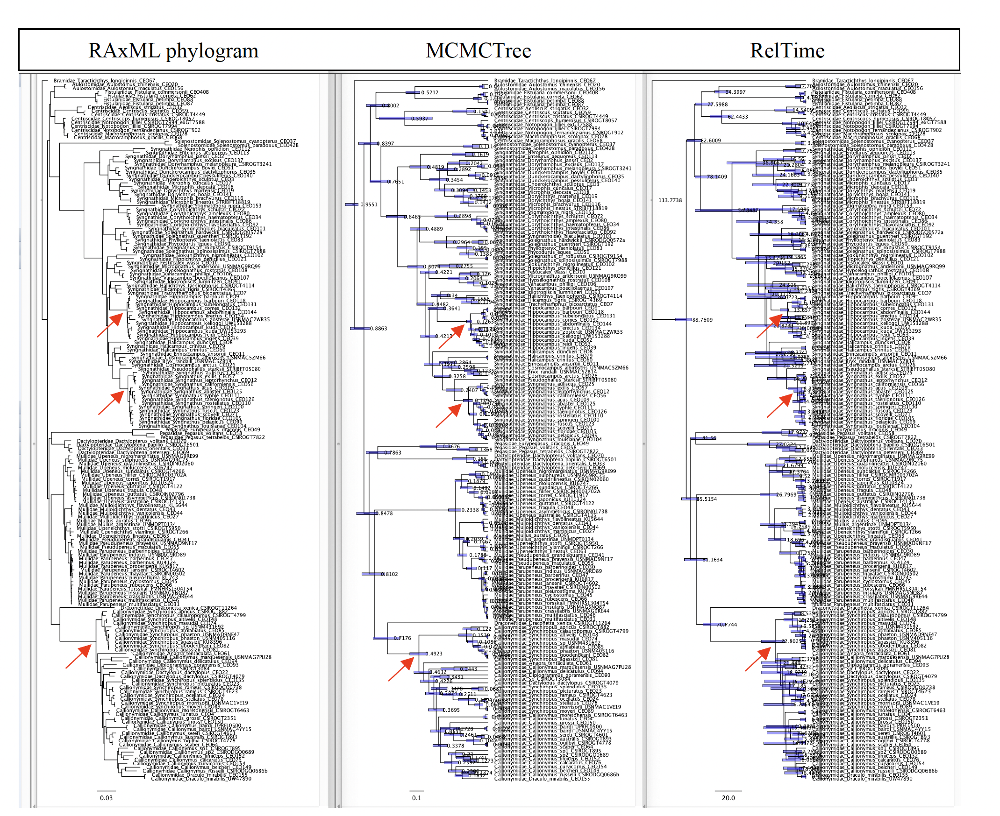
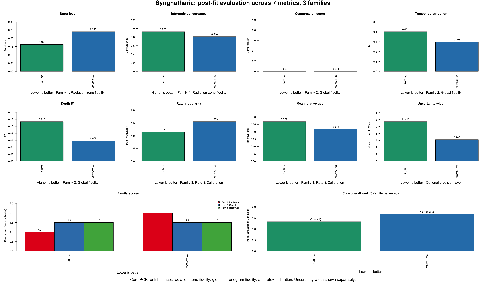
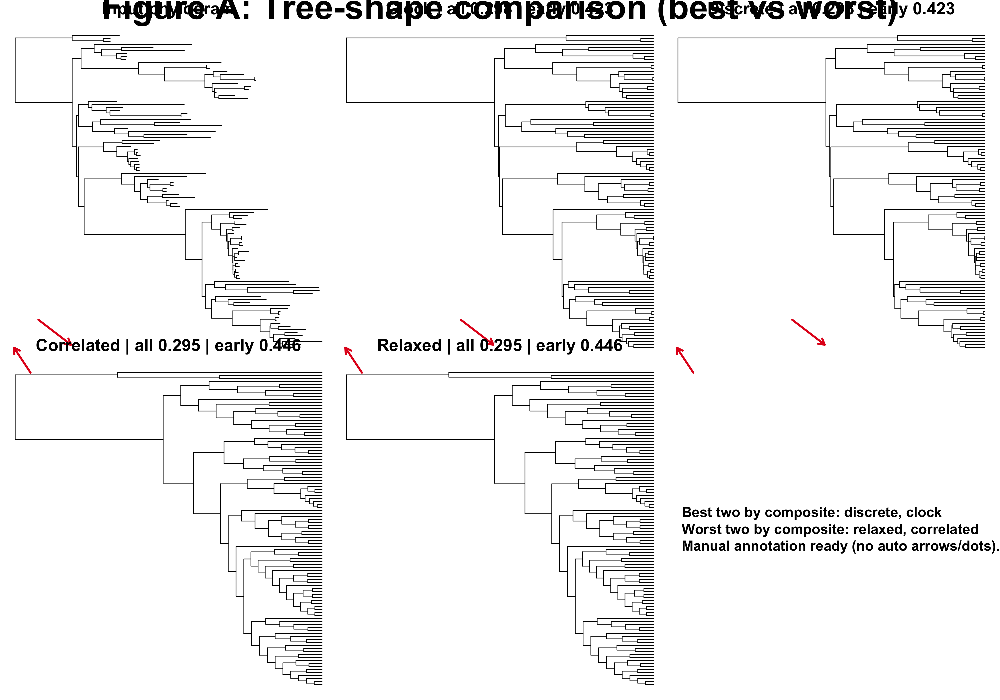
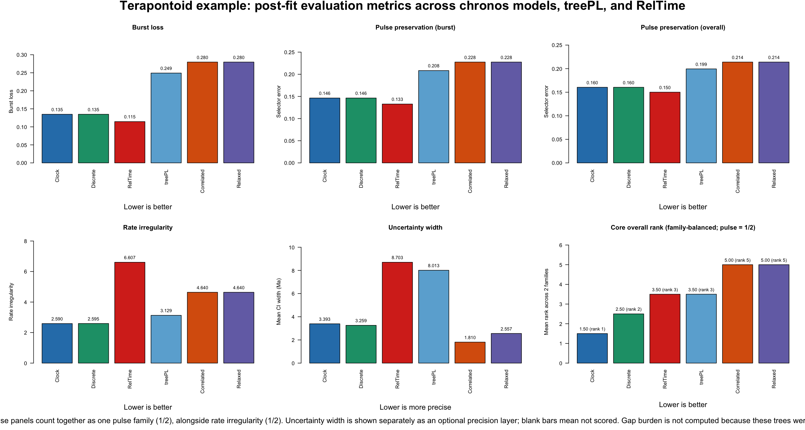
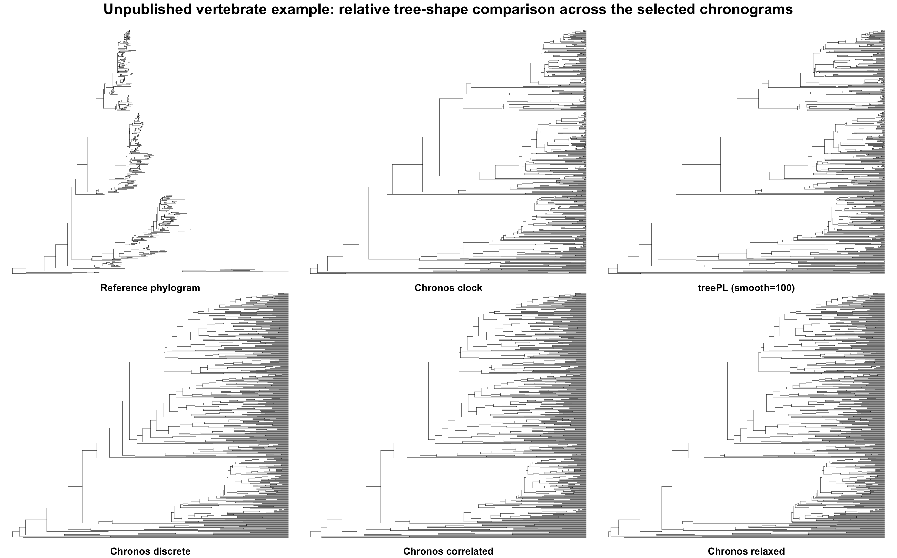
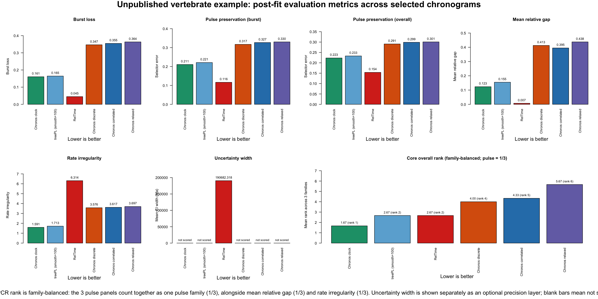

# PCR Postfit Metrics

`PCR Postfit Metrics` is a post-fit evaluation framework for phylogeneticists who already have a set of competing chronograms and need to decide which one is the most biologically defensible.

In simple terms, the core idea is that divergence-time estimation is hard: the resulting chronogram can shift substantially with clock-model choice, tree priors, calibration priors, and other analytical decisions ([Lepage et al. 2007](https://doi.org/10.1093/molbev/msm193); [dos Reis et al. 2016](https://doi.org/10.1038/nrg.2015.8); [Bromham et al. 2018](https://doi.org/10.1111/brv.12390)). A practical response is to compare a defensible set of alternative chronograms after they have been estimated, rather than betting everything on a single, computationally intensive "gold-standard" analysis and then treating that one tree as settled.

It is method-agnostic. The candidates can come from `BEAST`, `MCMCTree`, `MrBayes`, `chronos`, `treePL`, `RelTime`, or any other dating workflow.

PCR starts from finished chronograms. If you need to generate a set of chronograms from three alternative methods (`chronos`, `treePL`, `RelTime`) using an unconstrained phylogram and a calibration set, you can do that here: [PCR Custom Dating Pipeline From Phylograms](../1_PCR_CUSTOM_DATING_PIPELINE_FROM_PHYLOGRAMS/README.md).

## What it evaluates

`PhyloChronoRank (PCR)` uses three core metric families grouped by scope — what part of the tree they evaluate. This prevents double-counting between families while allowing complementary metrics within each family to reinforce one another:

- **Family 1** evaluates radiation zones (cladogenetic bursts)
- **Family 2** evaluates global tree structure outside bursts
- **Family 3** evaluates the dating method's parametric behavior (rates and calibration fit)

Within each family, per-metric ranks are averaged; across families, the three family averages are averaged. This ensures no single scope dominates regardless of metric count per family ([Garland et al. 1993](https://doi.org/10.1093/sysbio/42.3.265)). These are implementation-level diagnostics rather than named published indices; the citations below support the underlying biological ideas each family is trying to capture. All PCR scores are oriented so that lower is better. Ties use `average` ranking to preserve the rank-sum invariant. When all candidates produce the same raw value on a metric (zero variance), that metric is excluded via `NA` so it cannot dilute discriminatory metrics.

### Family 1 — Radiation-Zone Fidelity (1/3)

**Metrics:** `burst_loss`, `internode_concordance`

This family asks whether a dated tree keeps the same branching rhythm seen in the source phylogram within rapid radiations. In practice, this means preserving the clustered speciation bursts — short internodes packed together — instead of smearing them into evenly spaced splits.

The biological motivation is that substitution-rate bursts associated with speciation events are well documented: [Pagel et al. (2006)](https://doi.org/10.1126/science.1129647) showed that a large fraction of molecular divergence accumulates in punctuational bursts at cladogenesis rather than gradually along branches. The RCS (Relaxed Clock with Spikes) model formalizes this, showing that punctuated molecular evolution is detectable and should be preserved by dating methods ([Manceau et al. 2020](https://doi.org/10.1093/molbev/msaa144)). [Duchêne et al. (2022)](https://doi.org/10.1186/s12862-022-02024-5) showed that standard relaxed-clock models can fail to recover correct divergence times when molecular evolution is punctuated rather than gradual — exactly the failure mode these metrics are designed to catch.

- `burst_loss` — How much of the radiation-burst signal is destroyed during dating. If the phylogram shows tightly clustered speciation events (short internodes packed together, separated by longer quiet intervals) and the chronogram smears them into evenly spaced splits, the penalty is high. This measures loss of temporal clustering — the CV of inter-event spacing drops — not branch collapse to zero.

- `internode_concordance` — Whether the relative ordering and spacing of internodes within radiation zones is preserved. A phylogram might show three rapid splits followed by a pause; a good chronogram should maintain that same internal tempo, not reshuffle the node sequence.

### Family 2 — Global Chronogram Fidelity (1/3)

**Metrics:** `compression_score`, `tempo_redistribution`, `depth_r2`

Outside radiation zones, the backbone of the tree — the deep splits and the overall pacing of divergence events — should be largely preserved from phylogram to chronogram, modulated by rate variation. Different relaxed-clock models accommodate rate heterogeneity in different ways ([Lartillot et al. 2016](https://doi.org/10.1098/rstb.2015.0132); [Lepage et al. 2007](https://doi.org/10.1093/molbev/msm193)), and model choice directly affects how faithfully backbone timing is recovered. This family checks whether the dating method introduced global distortions.

- `compression_score` — Detects places where the chronogram collapses well-separated phylogram branches into near-simultaneous splits that were not in the original tree. This flags artificial compression — a known artifact where prior specifications and clock model choices can systematically distort branch lengths ([Bromham et al. 2018](https://doi.org/10.1111/brv.12390)). A recurrent issue with some dating methods, particularly `RelTime`, where genuine divergence events get squeezed into near-polytomies.

- `tempo_redistribution` — How much the dating method reshuffles the timing of non-burst nodes relative to the phylogram. Measured as the earth mover's distance between non-burst node-depth distributions in the phylogram vs. chronogram. Less redistribution is better: it means the dating method preserved the phylogram's temporal backbone rather than rearranging it.

- `depth_r2` — Overall correlation between node depths in the phylogram and chronogram. A high R² means the chronogram largely respects the relative ordering and spacing of divergence events encoded in the phylogram. Under realistic rate variation this will not be perfect, but a good dating method should not scramble the depth structure.

### Family 3 — Rate & Calibration (1/3)

**Metrics:** `rate_irregularity`, `mean_relative_gap`

For each branch, dividing the phylogram branch length (substitutions) by the chronogram branch duration (time) gives an implied evolutionary rate. This family evaluates whether those implied rates are biologically plausible and whether the chronogram respects its calibration constraints. Rate estimation and calibration fit are the two fundamental axes along which dating methods can fail independently of tree topology ([dos Reis et al. 2016](https://doi.org/10.1038/nrg.2015.8); [Ho & Duchêne 2014](https://doi.org/10.1111/mec.12953)).

- `rate_irregularity` — The score rises when implied rates are too dispersed or produce too many outlier branches. This follows the penalized-likelihood and relaxed-clock literature on among-lineage rate variation ([Sanderson 2002](https://doi.org/10.1093/oxfordjournals.molbev.a003974); [Lepage et al. 2007](https://doi.org/10.1093/molbev/msm193); [Ho & Duchêne 2014](https://doi.org/10.1111/mec.12953)). The metric penalizes erratic, unpatterned rate jumps that suggest overfitting or poor convergence rather than genuine biological rate heterogeneity.

- `mean_relative_gap` — For non-fixed calibration constraints (ranges, not point calibrations), measures how far estimated node ages sit from calibration interval boundaries relative to interval width. A chronogram that places calibrated nodes right at the edge of their prior ranges may be "rail-riding" — constrained by the prior rather than informed by the data ([Szöllősi et al. 2022](https://doi.org/10.1093/sysbio/syab084)). This is the same general idea as ghost-lineage and stratigraphic-congruence measures ([Huelsenbeck 1994](https://doi.org/10.1017/S009483730001294X); [Wills 1999](https://doi.org/10.1080/106351599260148)). It should be interpreted carefully: fossils usually provide minimum ages, not true lineage origins, so a tree that minimizes this too aggressively can simply be too young overall ([Parham et al. 2012](https://doi.org/10.1093/sysbio/syr107)). `NA` when all calibrations are fixed, in which case it drops from Family 3.

### Uncertainty Width (Optional Precision Layer)

Measures how wide the confidence or credible intervals are around estimated node ages. Narrower intervals indicate greater precision, though precision and accuracy are distinct properties. Frequentist confidence intervals and Bayesian credibility intervals arise from different statistical frameworks and are not directly commensurable ([Paradis et al. 2023](https://doi.org/10.1016/j.ympev.2022.107652); [Drummond et al. 2006](https://doi.org/10.1371/journal.pbio.0040088); [Bromham 2019](https://doi.org/10.1016/j.tree.2019.01.017); [Tao et al. 2020a](https://academic.oup.com/mbe/article/37/1/280/5602325); [Tao et al. 2020b](https://academic.oup.com/mbe/article/37/6/1819/5771370)), so they are usually reported side by side rather than collapsed into one score ([Costa et al. 2022](https://bmcgenomics.biomedcentral.com/articles/10.1186/s12864-022-09030-5); [Beavan et al. 2020](https://academic.oup.com/gbe/article/12/7/1087/5842139)). PhyloChronoRank scores this layer only when intervals derive from comparable methodology across candidates. The analytical delta-method `RelTime` CI of [Tao et al. 2020a](https://academic.oup.com/mbe/article/37/1/280/5602325) is kept as a supplemental diagnostic because it can diverge sharply from bootstrap widths after bound projection.

### Scoring Procedure

1. Rank candidates per metric (lower = better, except `internode_concordance` and `depth_r2` where higher = better).
2. Zero-variance exclusion: if all candidates tie on a metric, it carries no discriminatory power and is set to `NA`.
3. Average ranks within each family (`na.rm = TRUE`).
4. Average the three family scores for the final composite rank.

<details>
<summary><strong>Compact formulas used in the current implementation</strong></summary>

#### Family 1

`burst_loss`

```text
burstiness = sd(inter-event waits) / mean(inter-event waits)   # CV of spacing
burst_loss_clade = max(0, (burstiness_ref - burstiness_est) / (burstiness_ref + 1e-12))
mean_burst_loss = weighted mean across matched radiation-zone clades
weight_clade = log(1 + n_tips) * sqrt(n_events)
```

What it means: how much temporal clustering was smeared away in each matched radiation zone. A burstiness CV near 1 or above means events are tightly clustered with quiet gaps between clusters; a CV near 0 means events are evenly spaced. `burst_loss` measures the fractional drop in that CV. Larger and more event-rich zones are given more weight.

`internode_concordance`

```text
cv_ref = internode CV in the reference phylogram subclade
cv_est = internode CV in the candidate chronogram subclade
concordance = min(cv_ref, cv_est) / max(cv_ref, cv_est)
internode_concordance = mean(concordance) across matched radiation zones
```

What it means: a ratio near 1 means the chronogram preserves the same coefficient of variation of internode distances as the phylogram within each radiation zone. Lower CV concordance means the dating method changed how evenly or unevenly the burst nodes are spaced.

#### Family 2

`compression_score`

```text
est_near_zero = 0.1% of chronogram total depth
ref_short_threshold = 5th percentile of phylogram internal branch lengths
compressed = branches where chronogram_bl <= est_near_zero AND phylogram_bl > ref_short_threshold
compression_score = n_compressed / n_total_matched_internal
```

What it means: fraction of internal branches that the chronogram collapsed to near-zero length even though the phylogram shows non-trivial branch lengths there. Higher = more artificial compression.

`tempo_redistribution`

```text
Exclude all internal nodes inside radiation zones (BFS traversal from zone roots).
ref_depths = normalized depths of remaining non-burst internal nodes in phylogram
est_depths = normalized depths of matching nodes in chronogram (matched by tip-set signature)
tempo_redistribution = Wasserstein-1 distance between sorted ref_depths and sorted est_depths
```

What it means: earth mover's distance between backbone (non-burst) node-depth distributions. Lower = the dating method preserved the phylogram's temporal backbone rather than rearranging it.

`depth_r2`

```text
Match all internal nodes between phylogram and chronogram by tip-set signature.
Normalize depths to [0, 1] within each tree.
depth_r2 = R² from lm(chronogram_depth ~ phylogram_depth)
```

What it means: overall goodness-of-fit between relative node depths. Higher R² = the chronogram respects the phylogram's depth structure.

#### Family 3

`rate_irregularity`

```text
branch_rate = phylogram_branch_length / chronogram_branch_duration
log_rate_sd = sd(log(branch_rate))
extreme_rate_frac = fraction of branches with log(rate) outside 1.5 * IQR of log-rates
rate_irregularity = log_rate_sd + 2 * extreme_rate_frac
```

What it means: the score rises when branchwise rates are more dispersed or produce more extreme outlier branches.

`mean_relative_gap`

```text
For each non-fixed (window) calibration:
  ghost_gap = node_age - age_min
  relative_gap = ghost_gap / age_min
mean_relative_gap = mean(relative_gap) across non-fixed calibrations only
```

What it means: the average amount of extra inferred lineage history beyond the calibration minima, scaled by the minimum ages. Fixed (point) calibrations are excluded because there is no window to evaluate. With secondary or congruified ages, report it separately as calibration slack or omit it from the core rank.

#### Overall scoring

```text
family_radiation = mean(rank_burst_loss, rank_internode_concordance)
family_global = mean(rank_compression_score, rank_tempo_redistribution, rank_depth_r2)
family_ratecal = mean(rank_rate_irregularity, rank_mean_relative_gap)
overall_rank = mean(family_radiation, family_global, family_ratecal)
```

What it means: each family contributes exactly `1/3` of the final rank. Within each family, metrics contribute equally. If a metric is `NA` (zero variance or not computable), it drops from its family average. If an entire family is `NA`, the overall score averages across the remaining families.

</details>

## Run PCR on your own data

`PhyloChronoRank (PCR)` includes a standalone runner:

- `scripts/run_pcr.R`

At minimum, it expects:

- one reference phylogram
- one candidate manifest with `candidate,tree_file`

Optional:

- `--calibrations-csv` when you want PCR to score the calibration-fit / gap layer
- `--uncertainty-csv` when you want to report the optional precision layer from a separate interval-width table

If you do not provide `--uncertainty-csv`, PCR will still try to extract interval widths directly from annotated Newick trees.

Example commands:

```bash
Rscript scripts/run_pcr.R \
  --ref-tree=examples/terapontoid/Terapontoid_ML_MAIN_phylogram_used.tree \
  --candidates-csv=examples/terapontoid/candidates.csv \
  --outdir=out/terapontoid
```

```bash
Rscript scripts/run_pcr.R \
  --ref-tree=examples/syngnatharia/backbone_Raxml_besttree_matrix75.tre \
  --candidates-csv=examples/syngnatharia/candidates.csv \
  --calibrations-csv=examples/syngnatharia/calibrations_by_candidate.csv \
  --uncertainty-csv=examples/syngnatharia/uncertainty_summary_long.csv \
  --outdir=out/syngnatharia
```

To validate the bundled examples and the displayed README tables, run:

```bash
Rscript scripts/validate_examples.R
```

## Example 1: Empirical dataset with two competing chronograms (Syngnatharia)

### Visual choice before metrics

This example is different. It does not start from a `chronos` fit search. It starts from an earlier visual comparison among the `RAxML` phylogram, `MCMCTree`, and `RelTime`. In that original comparison, the practical choice was to favor `RelTime` because it visually preserved the diversification bursts in the phylogram better than `MCMCTree`, as discussed in [Santaquiteria et al. 2024](https://www.journals.uchicago.edu/doi/10.1086/733931).

That is the key point of this first example: the choice to prefer `RelTime` came first as a visual judgment. The post-fit metrics quantify that visual rationale.

### Quick takeaway

- `RelTime` is the core PCR winner in this comparison
- `RelTime` wins all three pulse summaries and also wins `rate irregularity`
- `MCMCTree` wins the simple calibration-fit layer through lower `mean relative gap`
- `MCMCTree` also has narrower extracted HPD bars, so it wins the optional precision layer on interval width
- `Figure A` is the original visual rationale from the paper; `Figure B` is the quantitative post-fit follow-up

### Figure A: Original visual rationale from the paper



This is the original paper figure from [Santaquiteria et al. 2024](https://www.journals.uchicago.edu/doi/10.1086/733931) that motivated the visual preference for `RelTime`. The RAxML phylogram on the left shows clustered branching bursts in several parts of the tree. In the middle panel, `MCMCTree` spreads many of those events out more evenly through time. In the right panel, `RelTime` better tracks the burst structure seen in the phylogram. That was the original rationale back then. This panel addresses the pulse issue only. It does not show the calibration-fit layer or the rate layer.

### Ranked post-fit results (lower is better)

The core PCR rank shown below is family-balanced across `pulse`, `mean relative gap`, and `rate irregularity`, so pulse contributes one-third of the final score. Here the gap layer is informative because the comparison uses primary calibration information summarized from Table S2 rather than secondary congruified ages. The uncertainty-width layer is shown separately as an additional precision consideration, not folded into the core winner, because interval width reflects method-dependent precision rather than the same chronogram-behavior axis captured by pulse, gap, and rate. In this example, that separate reporting appears in two places: the `uncertainty width` column in the table and the `Uncertainty width` panel in Figure B. The uncertainty widths are based on extracted HPD-width spreadsheets because the supplied Newick trees do not themselves contain embedded interval metadata.

| candidate | burst loss (lower is better) | pulse preservation (burst; lower is better) | pulse preservation (overall; lower is better) | mean relative gap (lower is better) | rate irregularity (lower is better) | uncertainty width (mean HPD width, Ma; lower is better) | core overall mean rank (pulse = 1/3; lower is better) |
| --- | ---: | ---: | ---: | ---: | ---: | ---: | ---: |
| `RelTime` | `0.1620` | `0.1874` | `0.2077` | `0.2689` | `1.1514` | `11.41` | `1.33` |
| `MCMCTree` | `0.2396` | `0.2560` | `0.2600` | `0.2184` | `1.5531` | `6.24` | `1.67` |

### Figure B: Post-fit comparison across metric families



Figure B shows the core PCR comparison and also displays `uncertainty width` as a separate optional precision layer. The three pulse panels are still averaged into one pulse-family contribution, and in the core PCR rank `pulse`, `mean relative gap`, and `rate irregularity` each contribute one-third.

That separation is deliberate. The RelTime literature does not support a simple story that wider intervals are automatically worse or are just a generic consequence of not using MCMC. Instead, broader RelTime intervals are often discussed as a precision-versus-coverage tradeoff: the analytical confidence-interval procedure explicitly propagates branch-length uncertainty and rate heterogeneity, which can yield wider intervals than other fast methods and, in some scenarios, wider intervals than Bayesian HPDs. Those broader intervals can improve coverage while reducing precision ([Tao et al. 2020](https://academic.oup.com/mbe/article/37/1/280/5602325); [Costa et al. 2022](https://bmcgenomics.biomedcentral.com/articles/10.1186/s12864-022-09030-5); [Beavan et al. 2020](https://academic.oup.com/gbe/article/12/7/1087/5842139)). That is why PCR reports interval width here as an additional consideration rather than treating it as a fourth co-equal family in the core rank.

### Interpretation for this example

- `RelTime` is the core PCR winner because it leads all three pulse summaries and also leads `rate irregularity`, while losing only the simple calibration-fit layer
- `MCMCTree` has the lower `mean relative gap`, so it stays closer to the calibration minima on average in this scoring
- `MCMCTree` also has the narrower extracted HPD bars, so it wins the optional uncertainty-width layer on precision
- the post-fit metrics therefore support, rather than reverse, the original visual rationale from Figure A: `RelTime` better preserves the branching bursts seen in the RAxML phylogram
- this is exactly the kind of case where a visual choice made before these metrics existed can now be quantified explicitly instead of being left as impression only

### Practical decision rule

1. If you want the core PCR winner focused on chronogram behavior, choose `RelTime`.
2. If you care most about preserving diversification bursts and smoother implied rate behavior, choose `RelTime`.
3. If you care primarily about calibration fit and narrower interval estimates, `MCMCTree` wins `mean relative gap` and the optional uncertainty-width layer.
4. Report the tradeoff explicitly: here the core chronogram-behavior layer favors `RelTime`, while the calibration-plus-precision side favors `MCMCTree`.
5. The original visual choice to favor `RelTime` is supported quantitatively by the current core post-fit layer.

<details>
<summary><strong>Files behind this example</strong></summary>

- `examples/syngnatharia/candidates.csv`
- `examples/syngnatharia/calibrations_by_candidate.csv`
- `examples/syngnatharia/backbone_Raxml_besttree_matrix75.tre`
- `examples/syngnatharia/CalibratedTree_backbone_MCMCTree_matrix75_RAXML.tre`
- `examples/syngnatharia/CalibratedTree_backbone_RelTime_matrix75_RAXML.tre`
- `examples/syngnatharia/Fig_S5_Burst_preservation.png`
- `examples/syngnatharia/syngnatharia_HPD_summary.csv`
- `examples/syngnatharia/syngnatharia_HPD_widths_extracted.csv`
- `examples/syngnatharia/uncertainty_summary_long.csv`
- `examples/syngnatharia/postfit_metrics/syngnatharia_postfit_metrics.csv`
- `examples/syngnatharia/postfit_metrics/syngnatharia_fossil_gap_side_by_side.csv`
- `examples/syngnatharia/postfit_metrics/syngnatharia_tableS2_method_audit.csv`
- `figures/syngnatharia_postfit_metric_family_values.png`
- `scripts/run_pcr.R`
- `scripts/make_syngnatharia_postfit_figures.R`

</details>

## Example 2: Empirical dataset with six competing chronograms (Terapontoidei)

### Optional upstream fit context

This tab does not do model fitting; that workflow lives in tab 1. In this example, the upstream fit statistics and the post-fit results still point to the same two `chronos` models. `clock` has the best `PHIIC` in the fit summary. `discrete` has the best penalized log-likelihood. Under the core PCR comparison, `clock` is the strongest balanced `chronos` tree and `discrete` is the close runner-up.

### Quick takeaway

- the core PCR comparison in this example uses `pulse` and `rate irregularity`, not `gap burden`, because the dates come from secondary / congruified calibration ages rather than primary calibration evidence
- `chronos_clock` is the clear winner under the two-family core rank
- `chronos_discrete` is the close runner-up
- `RelTime` is the strongest pulse-preservation candidate, but it pays a large `rate irregularity` penalty
- `chronos_clock` is the best tree for `rate irregularity`
- the optional uncertainty layer is available here for all six trees on one shared bootstrap scale
- `treePL` is a middle-tier candidate rather than a leading tree in this example

In this bundled six-tree comparison, the selected `treePL` candidate uses `smooth = 0.01`; it is labeled simply `treePL` below because only one `treePL` tree is carried forward into the example.

### Figure A: Pulse-layer tree-shape comparison among bundled chronos trees



This figure shows the pulse layer directly on alternative `chronos` trees (estimated with different clock models); `treePL` and `RelTime` are not shown here. It helps explain the upstream `chronos` pulse tradeoffs, but the quantitative post-fit comparison below also includes `treePL` and `RelTime`. This figure is only to illustrate the pulse issue; `gap burden` is not computed in this example, and the panel does not show the `rate irregularity` part of the broader PCR toolkit.

### Ranked post-fit results (lower is better)

`gap burden` is not computed in this example because the trees were dated using congruified / secondary calibration ages rather than primary calibration evidence. In that setting, a gap score would just measure how closely each method reproduced inherited ages rather than providing an independent biological diagnostic.

The overall mean rank below is therefore family-balanced across pulse and rate only. The three pulse summaries are shown separately for transparency, but they are first collapsed into one pulse-family contribution. So pulse as a whole contributes one-half of the final overall rank, and `rate irregularity` contributes the other half. The optional uncertainty-width layer is reported separately as a precision check and is not folded into the core rank. The last column reports that mean-rank value itself (`rank_mean_core`), not the separate ordinal finish position (`rank_mean_core_rank`).

The uncertainty-width contrasts here should be read cautiously. The shared table uses one bootstrap comparison scale: the four `chronos` rows come from the vendored parametric bootstrap helper of [Paradis et al. 2023](https://doi.org/10.1016/j.ympev.2022.107652), while `treePL` and `RelTime` come from repo-local bootstrap reruns under the same branch-length resampling design. The [Tao et al. 2020](https://academic.oup.com/mbe/article/37/1/280/5602325) analytical `RelTime` CI is supplemental and not reported in the table because, on these hard-bounded empirical trees, it lives in a completely different numerical universe from the bootstrap widths: after full-bound projection compresses internal durations, the analytical variance term can explode by orders of magnitude.

| candidate | burst loss (lower is better) | pulse preservation (burst; lower is better) | pulse preservation (overall; lower is better) | rate irregularity (lower is better) | uncertainty width (mean CI width, Ma; lower is better) | overall mean rank (pulse = 1/2; lower is better) |
| --- | ---: | ---: | ---: | ---: | ---: | ---: |
| `chronos_clock` | `0.1348` | `0.1464` | `0.1604` | `2.5897` | `3.39` | `1.50` |
| `chronos_discrete` | `0.1349` | `0.1464` | `0.1605` | `2.5946` | `3.26` | `2.50` |
| `treePL` | `0.2492` | `0.2083` | `0.1995` | `3.1294` | `8.01` | `3.50` |
| `RelTime` | `0.1145` | `0.1328` | `0.1501` | `6.6066` | `8.70` | `3.50` |
| `chronos_relaxed` | `0.2797` | `0.2275` | `0.2140` | `4.6401` | `2.56` | `5.00` |
| `chronos_correlated` | `0.2797` | `0.2275` | `0.2140` | `4.6401` | `1.81` | `5.00` |

In short: `RelTime` minimizes all three pulse summaries, `chronos_clock` leads `rate irregularity`, and `chronos_clock` has a clean edge over `chronos_discrete` in the two-family core rank. `treePL` lands in the same mean-rank tier as `RelTime`, but for the opposite reason: better rate behavior with much weaker pulse preservation. On the optional precision layer, the four `chronos` trees are the narrowest on the shared bootstrap scale, `treePL` is broader than all four `chronos` trees but slightly narrower than `RelTime`, and `chronos_correlated` is the narrowest overall.

### Figure B: Post-fit comparison across metric families



Figure B uses the same family-balanced rule as the table. Even though three pulse panels are shown, they do not count as three separate halves. They are averaged into one pulse-family contribution, and that pulse family contributes one-half of the overall rank. `gap burden` is intentionally absent here because the calibration ages are secondary / congruified rather than primary evidence. `Uncertainty width` is shown separately as an optional precision layer.

### Interpretation for this example

- `chronos_clock` is the core PCR winner
- `chronos_discrete` is the runner-up
- `RelTime` is the strongest tree on all three pulse summaries
- `chronos_clock` is the best tree on `rate irregularity`
- the optional uncertainty layer is led by the non-clock `chronos` trees on width alone, with `chronos_correlated` narrowest and `chronos_relaxed` next
- `treePL` beats both non-clock `chronos` trees on the core comparison, but it still trails `chronos_clock` and `chronos_discrete`
- `treePL` is broader than all four `chronos` trees on the shared bootstrap layer, but slightly narrower than `RelTime`
- `RelTime` has broader bootstrap widths than any of the `chronos` candidates in this example, so it loses the optional precision layer
- the supplemental Tao-style `RelTime` CI file is not mixed into the table because on this hard-bounded point tree it lives in a completely different numerical regime from the bootstrap widths
- `chronos_correlated` and `chronos_relaxed` are the weakest candidates in the set under the post-fit layer

### Practical decision rule

1. If you want the strongest pulse-preservation candidate, choose `RelTime`.
2. If you want the smoothest implied rate behavior, choose `chronos_clock`.
3. If you want the narrowest bundled bootstrap intervals, `chronos_correlated` and `chronos_relaxed` are narrower on width alone, but they perform poorly on the core post-fit comparison.
4. If you want one concise core-PCR statement, report `chronos_clock` as the winner under the two-family comparison, with `chronos_discrete` as the close runner-up.
5. If an upstream fit-based selector and PCR point to different trees, report both explicitly rather than collapsing them into one claim.
6. In this example, `RelTime` behaves like a pulse specialist, while `treePL` acts as a mid-ranking rate-friendlier alternative rather than a leading tree. On the shared bootstrap uncertainty layer, `treePL` sits between the narrower `chronos` trees and the broader `RelTime` tree. The supplemental Tao-style `RelTime` CI file is discussed separately because it is not on the same numerical scale as the shared bootstrap summaries.

<details>
<summary><strong>Files behind this example</strong></summary>

- `examples/terapontoid/summary_terap_empirical_model_fits.csv`
- `examples/terapontoid/summary_terap_empirical_postfit_metrics.csv`
- `examples/terapontoid/uncertainty_summary_long.csv`
- `examples/terapontoid/candidates.csv`
- `examples/terapontoid/Terapontoid_ML_MAIN_calibrations_used.csv` (upstream congruified calibration ages used in dating; not scored in the core PCR rank)
- the six trees in `examples/terapontoid/`, including `Terapontoid_ML_MAIN_treePL_congruify.tre` and `Terapontoid_ML_MAIN_RelTime_full_bounds.tre`
- `examples/terapontoid/Terapontoid_ML_MAIN_chronos_dated_modelclock_ci.csv`
- `examples/terapontoid/Terapontoid_ML_MAIN_chronos_dated_modeldiscrete_ci.csv`
- `examples/terapontoid/Terapontoid_ML_MAIN_chronos_dated_modelcorrelated_ci.csv`
- `examples/terapontoid/Terapontoid_ML_MAIN_chronos_dated_modelrelaxed_ci.csv`
- `examples/terapontoid/Terapontoid_ML_MAIN_RelTime_bounds_used.csv`
- `examples/terapontoid/Terapontoid_ML_MAIN_treePL_congruify_bootstrap_ci.csv`
- `examples/terapontoid/Terapontoid_ML_MAIN_RelTime_full_bounds_bootstrap_ci.csv`
- `examples/terapontoid/Terapontoid_ML_MAIN_RelTime_full_bounds_ci.csv`
- `figures/branching_tempo_tree_panel_clean_v3.png`
- `figures/postfit_metric_family_values.png`
- `scripts/run_pcr.R`
- `scripts/chronos_ci_helpers.R`
- `scripts/reltime_helpers.R`
- `scripts/build_uncertainty_examples.R`
- `scripts/make_terapontoid_postfit_figures.R`
- `scripts/make_terapontoid_pulse_tree_panel.R`

</details>

## Example 3: Unpublished vertebrate dataset (derived outputs only)

### Quick takeaway

- `chronos_clock` is the core PCR winner in this comparison
- `treePL` and `RelTime` land in the next mean-rank tier for opposite reasons
- `RelTime` dominates the pulse and gap layers but is the worst tree on `rate irregularity`
- the optional uncertainty layer is available here for all six trees on one shared bootstrap scale
- `chronos_correlated`, `chronos_relaxed`, and `chronos_discrete` are all much worse on pulse, gap, and rate
- the raw trees and calibration table are not distributed here because this dataset is unpublished

### Selected candidates

This example uses `57` calibrations and compares six selected chronograms:

- `chronos_clock` with `lambda = 1`
- `chronos_correlated` with `lambda = 0.1`
- `chronos_relaxed` with `lambda = 0.1`
- `chronos_discrete` with `lambda = 0.1` and `nb_rate_cat = 5`
- `treePL` with best `smooth = 100`
- `RelTime`, projected onto the same merged full calibration bounds used by the local `chronos` and `treePL` pipelines

Only derived outputs are shown in this repository. The raw input trees and calibration table are withheld because the dataset is unpublished.

### Figure A: Relative tree-shape comparison across the selected chronograms



This panel compares the reference phylogram and the five originally selected chronograms after scaling each tree to its own maximum root-to-tip depth. The point is to show relative branching tempo, not absolute branch-length units. Tip labels are hidden, and the raw trees are not distributed. The added `RelTime` benchmark appears in the quantitative comparison below rather than in this legacy tree panel.

### Ranked post-fit results (lower is better)

The core PCR rank is family-balanced across `pulse`, `mean relative gap`, and `rate irregularity`, so pulse contributes one-third of the final score. The optional uncertainty-width layer is reported separately as a precision check and is not folded into the core rank.

The shared uncertainty table here uses one bootstrap comparison scale. The four `chronos` rows come from the vendored parametric bootstrap helper of [Paradis et al. 2023](https://doi.org/10.1016/j.ympev.2022.107652), while `treePL` and `RelTime` come from repo-local bootstrap reruns under the same branch-length resampling design. The [Tao et al. 2020](https://academic.oup.com/mbe/article/37/1/280/5602325) analytical `RelTime` CI is supplemental and not reported in the table because, on these hard-bounded empirical trees, it can live in a completely different numerical universe from the bootstrap widths after bound projection compresses internal durations.

| candidate | burst loss (lower is better) | pulse preservation (burst; lower is better) | pulse preservation (overall; lower is better) | mean relative gap (lower is better) | rate irregularity (lower is better) | uncertainty width (mean CI width, Ma; lower is better) | core overall mean rank (pulse = 1/3; lower is better) |
| --- | ---: | ---: | ---: | ---: | ---: | ---: | ---: |
| `chronos_clock` | `0.1606` | `0.2106` | `0.2233` | `0.1235` | `1.5915` | `30.04` | `1.67` |
| `treePL` | `0.1646` | `0.2209` | `0.2332` | `0.1548` | `1.7128` | `11.14` | `2.67` |
| `RelTime` | `0.0449` | `0.1164` | `0.1539` | `0.0072` | `6.3142` | `6.17` | `2.67` |
| `chronos_discrete` | `0.3468` | `0.3172` | `0.2909` | `0.4129` | `3.5759` | `23.33` | `4.00` |
| `chronos_correlated` | `0.3547` | `0.3268` | `0.2989` | `0.3951` | `3.6171` | `18.68` | `4.33` |
| `chronos_relaxed` | `0.3635` | `0.3302` | `0.3009` | `0.4377` | `3.6971` | `22.43` | `5.67` |

### Figure B: Post-fit comparison across metric families



Figure B uses the same family-balanced rule as the table. The three pulse panels are shown separately for transparency, but together they count as one pulse family. `Uncertainty width` is shown separately as an optional precision layer.

### Interpretation for this example

- `chronos_clock` is the core PCR winner in this comparison
- `treePL` and `RelTime` share the next mean-rank tier, but for opposite reasons
- `RelTime` is the strongest tree on all three pulse summaries and also has the smallest `mean relative gap`
- `treePL` has the cleanest `rate irregularity` in the set while staying close to `chronos_clock` on the pulse layer
- `chronos_discrete` is a weak candidate, and `chronos_correlated` and `chronos_relaxed` are no better
- `chronos_correlated` and `chronos_relaxed` both score poorly across the full post-fit layer, especially on `rate irregularity` and `mean relative gap`
- the bundled uncertainty layer is available here for all six trees, with `treePL` intermediate on the shared bootstrap precision layer
- `RelTime` is the pulse-plus-gap specialist and also the narrowest candidate on the shared bootstrap precision layer
- the supplemental Tao-style `RelTime` CI file is not mixed into the table because on this hard-bounded point tree it lives in a completely different numerical regime from the bootstrap widths
- in this dataset, the post-fit layer supports `chronos_clock` as the best balanced tree, `treePL` as the rate-friendlier close alternative, and `RelTime` as the pulse-plus-gap specialist

### Practical decision rule

1. If you want one core PCR winner in this comparison, choose `chronos_clock`.
2. If you want the closest balanced alternative under the current bundled outputs, `treePL` is the next-best point-estimate candidate.
3. If your priority is preserving branching tempo and staying closest to the calibration minima, consider `RelTime`, but report its poor `rate irregularity` explicitly.
4. If you discuss uncertainty in the bundled release, note that the shared table compares `chronos`, `treePL`, and `RelTime` bootstrap widths, while the Tao-style `RelTime` CI is kept supplemental only.
5. If you report multiple candidate chronograms, the main contrast is `chronos_clock` as the balanced winner, `treePL` as the close rate-friendlier alternative, and `RelTime` as the pulse-plus-gap alternative.

<details>
<summary><strong>Files behind this example</strong></summary>

- `examples/unpublished_vertebrate/postfit_metrics/summary_unpublished_vertebrate_postfit_metrics.csv`
- `examples/unpublished_vertebrate/postfit_metrics/uncertainty_summary_long.csv`
- `figures/unpublished_vertebrate_tree_panel.png`
- `figures/unpublished_vertebrate_postfit_metric_family_values.png`
- `scripts/chronos_ci_helpers.R`
- `scripts/reltime_helpers.R`
- `scripts/build_uncertainty_examples.R`
- `scripts/make_unpublished_vertebrate_postfit_figure.R`

</details>

<details>
<summary><strong>Scope notes</strong></summary>

- The pulse-family weights are user-chosen defaults. A small fixed robustness check across five perturbation sets is included in `examples/weight_sensitivity/`; neither the pulse-family winner nor the core PCR winner changed in either bundled example. A broader sensitivity analysis across additional datasets has not yet been done.
- The pulse family treats the source phylogram as the reference for branching rhythm. That is useful when the question is whether a dated tree preserves the tempo structure visible in the starting phylogram, but it should not be read as proof that the phylogram itself is the true diversification history.
- `rate irregularity` is useful for comparing candidates within the same dataset, but the absolute values are not meant to be compared across unrelated datasets.
- Under point calibrations, the gap layer behaves as symmetric calibration slack: older and younger deviations from the calibration point are penalized equally.
- `gap burden` should be treated as a core family only when the calibration ages are primary evidence. With secondary or congruified ages, the same calculation becomes circular calibration slack and is better reported separately or omitted from the core rank.
- PCR reports raw scores and ranks. It does not yet attach bootstrap or permutation p-values to score differences.
- The framework evaluates point chronograms. It does not yet propagate posterior tree uncertainty through the post-fit scores.
- The optional `uncertainty width` layer is reported separately from the core PCR rank. In the bundled examples it comes from extracted HPD widths in Syngnatharia and from matched `chronos`, `treePL`, and `RelTime` bootstrap summaries in Terapontoidei and the bundled vertebrate release. The Tao-style analytical `RelTime` CI is kept as a supplemental diagnostic and discussed in prose when it diverges sharply from the bootstrap scale. This layer speaks to precision, not accuracy.

</details>
