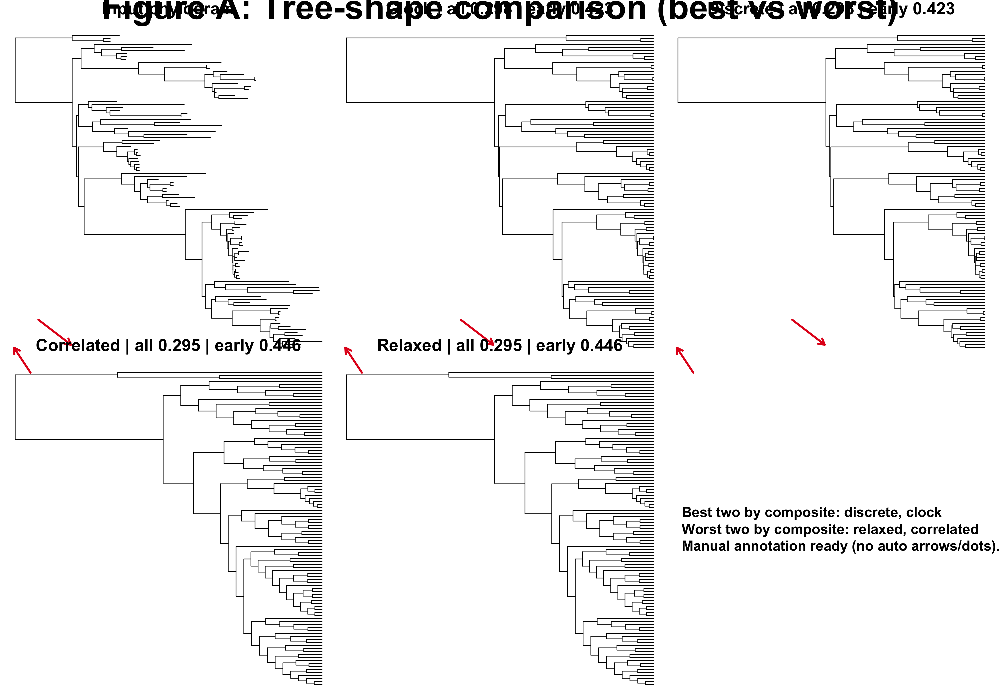
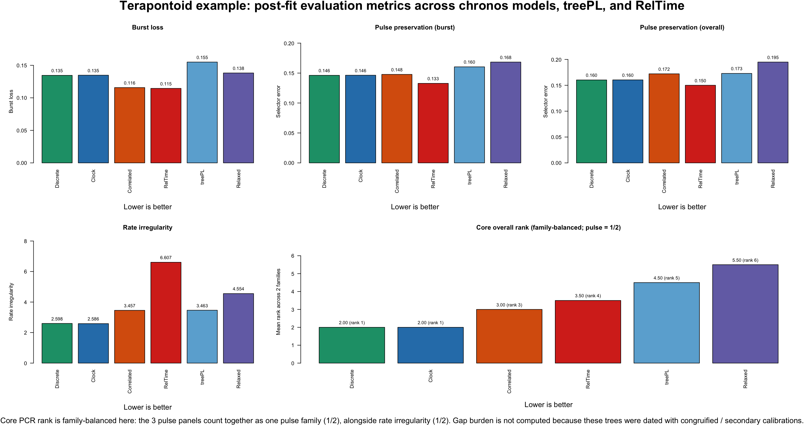
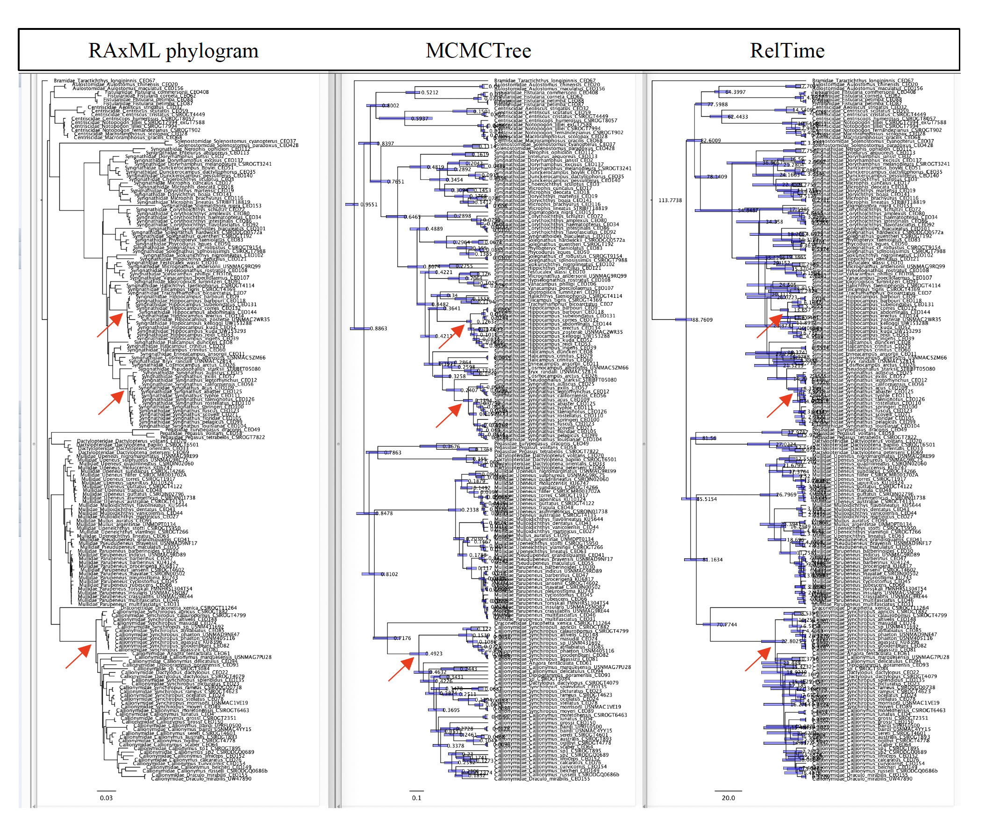
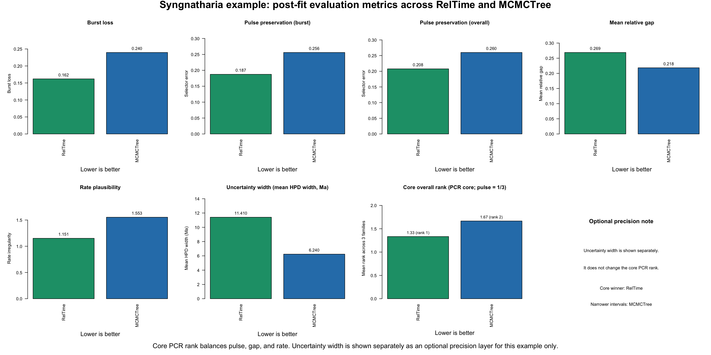
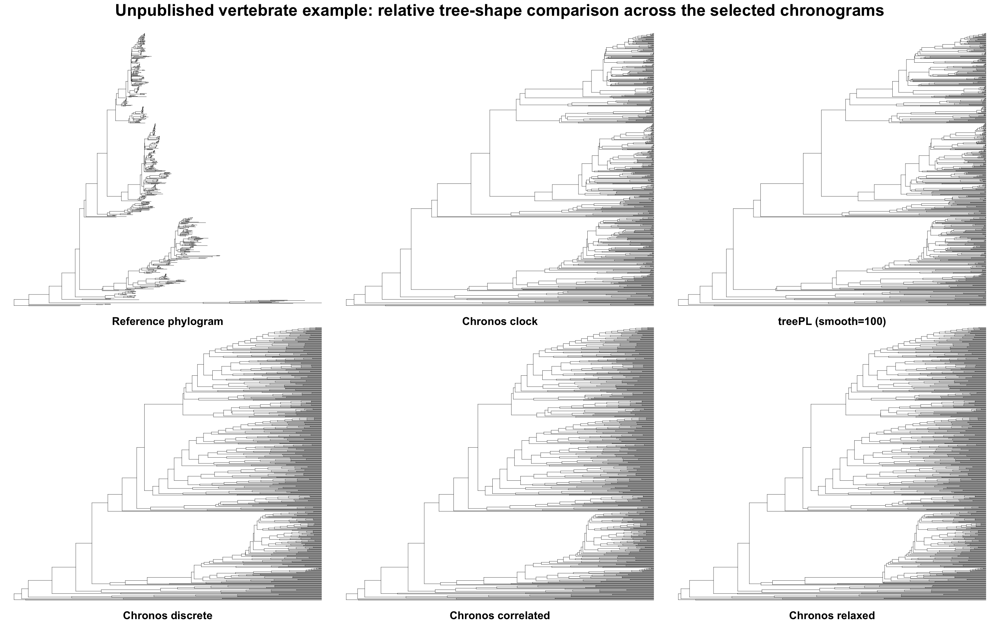
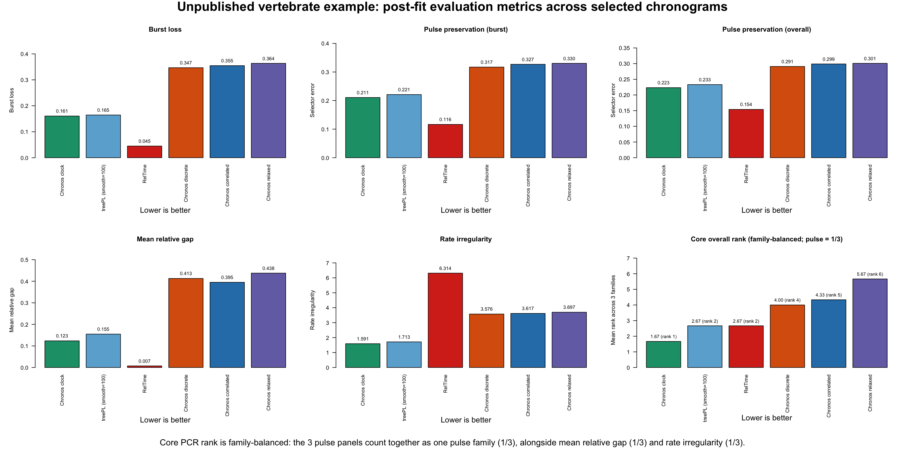

# PhyloChronoRank (PCR)

`PhyloChronoRank (PCR)` is a post-fit evaluation framework for phylogeneticists who already have a set of competing chronograms and need to decide which one is the most biologically defensible. It "amplifies" the signal already present in finished dated trees by scoring them under a common set of diagnostics.

In simple terms, the core idea is that divergence-time estimation is hard: the resulting chronogram can shift substantially with clock-model choice, tree priors, calibration priors, and other analytical decisions ([Lepage et al. 2007](https://doi.org/10.1093/molbev/msm193); [Warnock et al. 2015](https://doi.org/10.1098/rspb.2014.1013); [dos Reis et al. 2016](https://doi.org/10.1038/nrg.2015.8)). A practical response is to compare a defensible set of alternative chronograms after they have been estimated, rather than betting everything on a single long dating analysis and then treating that one tree as settled.

It is method-agnostic. The candidates can come from `chronos`, `treePL`, `RelTime`, `MCMCTree`, or any other dating workflow.

PCR starts from finished chronograms. It does not perform clock-model fitting. If your upstream workflow produced competing trees via explicit model fitting, you can report that fit context alongside PCR.

## What it evaluates

`PhyloChronoRank (PCR)` uses three core metric families. These are implementation-level diagnostics rather than named published indices; the citations below support the underlying ideas each family is trying to capture.

- `pulse preservation`: asks whether a dated tree keeps the same branching rhythm seen in the source phylogram. In practice, this means preserving clustered speciation bursts and quiet intervals instead of smearing them into evenly spaced splits. In this workflow, the pulse family is reported three ways: `burst loss` is the standalone burst-flattening submetric, `pulse preservation (burst)` is the burst-priority composite selector, and `pulse preservation (overall)` is the balanced composite selector. This follows the literature on extracting diversification tempo from phylogenies and on distinguishing burst-like from unusually regular branching patterns ([Nee et al. 1992](https://doi.org/10.1073/pnas.89.17.8322); [Pybus and Harvey 2000](https://doi.org/10.1098/rspb.2000.1278); [Ford et al. 2009](https://doi.org/10.1093/sysbio/syp018)).

- `gap burden`: asks how much extra unseen lineage history the dated tree implies relative to the calibration evidence. This is the same general idea as ghost-lineage and stratigraphic-congruence measures ([Huelsenbeck 1994](https://doi.org/10.1017/S009483730001294X); [Wills 1999](https://doi.org/10.1080/106351599260148); [O'Connor and Wills 2016](https://doi.org/10.1093/sysbio/syw039)). Lower is usually better, but it should be interpreted carefully: fossils usually provide minimum ages, not true lineage origins, so a tree that minimizes this too aggressively can simply be too young overall ([Parham et al. 2012](https://doi.org/10.1093/sysbio/syr107)).

- `rate irregularity`: for each branch, divides the phylogram branch length (substitutions) by the chronogram branch duration (time) to get an implied evolutionary rate. The score rises when those implied rates are too dispersed, jump sharply from parent to child branch, produce too many outlier branches, or lose the positive autocorrelation expected among closely related lineages. This follows the penalized-likelihood and relaxed-clock literature on among-lineage rate variation and autocorrelation ([Sanderson 2002](https://doi.org/10.1093/oxfordjournals.molbev.a003974); [Drummond et al. 2006](https://doi.org/10.1371/journal.pbio.0040088); [Lepage et al. 2007](https://doi.org/10.1093/molbev/msm193); [Ho 2009](https://doi.org/10.1098/rsbl.2008.0729); [Tao et al. 2019](https://doi.org/10.1093/molbev/msz014)).

- `uncertainty width` (optional precision layer): asks how wide the confidence or credible intervals are around node ages when those intervals are available in a comparable form across candidate chronograms. Lower is more precise, but this is a precision metric, not an accuracy metric. In molecular-dating comparisons, interval width is commonly treated as an uncertainty or precision summary rather than as a direct accuracy score, and confidence intervals versus credibility intervals are often reported side by side rather than collapsed into one score ([Tao et al. 2020](https://academic.oup.com/mbe/article/37/1/280/5602325); [Costa et al. 2022](https://bmcgenomics.biomedcentral.com/articles/10.1186/s12864-022-09030-5); [Beavan et al. 2020](https://academic.oup.com/gbe/article/12/7/1087/5842139)). In this documentation, this optional layer is shown only for the Syngnatharia example, but PCR can also summarize interval widths directly from annotated Newick trees when common embedded HPD/CI metadata are present.

<details>
<summary><strong>Compact formulas used in the current implementation</strong></summary>

`burst loss`

```text
burst_loss_clade = max(0, (burst_ref - burst_est) / (burst_ref + 1e-12))
mean_burst_loss = weighted mean across matched clades
weight_clade = log(1 + n_tips) * sqrt(n_events)
```

What it means: how much burstiness was flattened away in each matched clade, with larger and more event-rich clades given more weight.

`pulse preservation (overall)`

```text
local_error = 0.35 * mean_emd + 0.55 * mean_burst_loss + 0.10 * mean_centroid_shift
global_error = 0.35 * global_emd + 0.65 * global_burst_loss
pulse_overall = 0.80 * local_error + 0.20 * global_error + 0.20 * (1 - coverage)
```

What it means: a balanced pulse composite combining local clade rhythm, whole-tree rhythm, and how much of the reference pulse panel was actually matched. Here `emd` is the Earth Mover's Distance between relative event-time distributions, and `coverage = matched_clades / panel_clades`.

`pulse preservation (burst)`

```text
local_error_burst = 0.20 * mean_emd + 0.75 * mean_burst_loss + 0.05 * mean_centroid_shift
pulse_burst = 0.80 * local_error_burst + 0.20 * global_error + 0.20 * (1 - coverage)
```

What it means: the same pulse family, but with extra weight placed on keeping burst structure.

`gap layer`

```text
relative_gap_i = (node_age_i - age_min_i) / age_min_i
mean_relative_gap = mean(relative_gap_i)
```

What it means: the average amount of extra inferred lineage history beyond the calibration minima, scaled by the minimum ages. Depending on the comparison, this can behave as fossil-gap burden or as calibration slack.

`rate irregularity`

```text
branch_rate = phylogram_branch_length / dated_branch_duration
rate_irregularity = sd(log_rate) + mean_parent_child_jump + 2 * extreme_rate_frac + autocorr_penalty
autocorr_penalty = 1 - max(rate_autocorr_spearman, 0)
```

What it means: the score rises when branchwise rates are more dispersed, jump more sharply from parent to child, produce more extreme outlier branches, or lose positive autocorrelation.

`uncertainty width` (optional precision layer)

```text
mean_interval_width = mean(width_i)
median_interval_width = median(width_i)
```

What it means: lower values indicate narrower confidence or credible intervals and therefore greater precision. In the Syngnatharia example, these widths come from extracted HPD bars in the published figure rather than from interval metadata embedded in the Newick trees, but PCR can also summarize widths directly from annotated Newick trees when those intervals are present in embedded metadata.

`overall family-balanced rank`

```text
pulse_family_rank = mean(rank(burst_loss), rank(pulse_burst), rank(pulse_overall))
overall_mean_rank = mean(pulse_family_rank, gap_rank, rate_rank)
```

What it means: pulse contributes `1/3` of the final rank, gap contributes `1/3`, and rate contributes `1/3`.

</details>

## Run PCR on your own data

`PhyloChronoRank (PCR)` includes a standalone runner:

- `scripts/run_pcr.R`

At minimum, it expects:

- one reference phylogram
- one candidate manifest with `candidate,tree_file`

It can also take:

- a calibration table with `taxonA,taxonB,age_min,age_max` and an optional `candidate` column when calibration applicability differs by method
- an uncertainty table with `candidate` plus comparable interval-width summaries when you want to report the optional precision layer

If you do not provide `--uncertainty-csv`, PCR will try to extract interval widths directly from annotated Newick trees. When multiple or unusual metadata fields exist, a separate uncertainty CSV is still the safer option.

Example commands:

```bash
Rscript scripts/run_pcr.R \
  --ref-tree=examples/terapontoid/Terapontoid_ML_MAIN_phylogram_used.tree \
  --candidates-csv=examples/terapontoid/candidates.csv \
  --calibrations-csv=examples/terapontoid/Terapontoid_ML_MAIN_calibrations_used.csv \
  --outdir=out/terapontoid
```

```bash
Rscript scripts/run_pcr.R \
  --ref-tree=examples/syngnatharia/backbone_Raxml_besttree_matrix75.tre \
  --candidates-csv=examples/syngnatharia/candidates.csv \
  --calibrations-csv=examples/syngnatharia/calibrations_by_candidate.csv \
  --uncertainty-csv=examples/syngnatharia/uncertainty_summary_long.csv \
  --outdir=out/syngnatharia
```

To validate the bundled examples and the displayed README tables, run:

```bash
Rscript scripts/validate_examples.R
```

## Example 1: Empirical dataset with five competing chronograms (Terapontoidei)

### Optional upstream fit context

PCR itself does not do model fitting, but this example comes from a workflow where upstream fit statistics were available. Those upstream results and the post-fit results point in a similar direction here, but not in exactly the same way. `clock` has the best `PHIIC` in the fit summary. `discrete` has the best penalized log-likelihood and the best overall post-fit rank. So this is not a case where one model wins everything. It is a case where `clock` and `discrete` are the two strongest `chronos` candidates, but for different reasons.

### Quick takeaway

- `chronos_discrete` is the best overall tree in this post-fit comparison
- `chronos_clock` is a near-tie second and is the best tree for `rate irregularity`
- `treePL` is not the top solution in this example
- `Figure A` is only for the pulse issue; `Figure B` is the broader post-fit comparison

### Figure A: Pulse-layer tree-shape comparison among bundled chronos trees



This figure shows the pulse layer directly on alternative `chronos` trees (estimated with different clock models); `treePL` is not shown here. It helps explain why `discrete` and `clock` sit at the top of the pulse-preservation ranking. This figure is only to illustrate the pulse issue; it does not show the `gap burden` or `rate irregularity` parts of the broader PCR toolkit.

### Ranked post-fit results (lower is better)

In this example, `gap burden` behaves as `point-calibration slack`, not as fossil-minimum ghost-lineage burden, because the comparison uses point calibrations.

The overall mean rank below is family-balanced. The three pulse summaries are shown separately for transparency, but they are first collapsed into one pulse-family contribution. So pulse as a whole contributes one-third of the final overall rank, while `gap burden` and `rate irregularity` contribute the other two thirds.

| candidate | burst loss | pulse preservation (burst) | pulse preservation (overall) | gap burden | rate irregularity | overall mean rank (pulse = 1/3) |
| --- | ---: | ---: | ---: | ---: | ---: | ---: |
| `chronos_discrete` | `0.1346` | `0.1462` | `0.1603` | `0.0733` | `2.5982` | `1.44` |
| `chronos_clock` | `0.1348` | `0.1464` | `0.1605` | `0.0736` | `2.5861` | `1.78` |
| `chronos_correlated` | `0.1158` | `0.1478` | `0.1722` | `0.1058` | `3.4566` | `3.11` |
| `chronos_relaxed` | `0.1382` | `0.1684` | `0.1949` | `0.1030` | `4.5535` | `4.22` |
| `treePL` | `0.1550` | `0.1604` | `0.1729` | `0.1615` | `3.4631` | `4.44` |

In short: `chronos_discrete` leads both pulse selector summaries and `gap burden`, `chronos_correlated` minimizes the standalone `burst_loss` submetric, and `chronos_clock` leads `rate irregularity`. When pulse is treated as one family contributing one-third of the final score, `chronos_relaxed` edges above `treePL` overall because `treePL` has the highest `gap burden`.

### Figure B: Post-fit comparison across metric families



Figure B uses the same family-balanced rule as the table. Even though three pulse panels are shown, they do not count as three separate thirds. They are averaged into one pulse-family contribution, and that pulse family contributes one-third of the overall rank.

### Interpretation for this example

- `chronos_discrete` is the overall post-fit winner because it leads both pulse summaries and gap burden while staying near-best on rate irregularity
- `chronos_clock` is essentially tied at the top on pulse preservation, nearly tied on gap burden, and is the best tree on rate irregularity
- `chronos_correlated` sits in the middle and is the best tree on standalone `burst_loss`
- `treePL` beats `chronos_relaxed` on the two pulse selectors and on rate irregularity, but it has the highest gap burden in this comparison
- under the family-balanced overall rank, `treePL` drops below `chronos_relaxed` because pulse contributes only one-third of the final score

### Practical decision rule

1. If you want one overall post-fit winner, choose `chronos_discrete`.
2. If you want the best implied rate behavior, choose `chronos_clock`.
3. If you care specifically about the standalone burst-flattening penalty, `chronos_correlated` minimizes `burst_loss`.
4. If an upstream fit-based selector and PCR point to different trees, report both explicitly rather than collapsing them into one claim.
5. In this example, `treePL` is not the leading solution under the post-fit layer, and under family-balanced ranking it places last.

### Files behind this example

- `examples/terapontoid/summary_terap_empirical_model_fits.csv`
- `examples/terapontoid/summary_terap_empirical_postfit_metrics.csv`
- `examples/terapontoid/candidates.csv`
- `examples/terapontoid/Terapontoid_ML_MAIN_calibrations_used.csv`
- the five trees in `examples/terapontoid/`, including `Terapontoid_ML_MAIN_treePL_congruify.tre`
- `figures/branching_tempo_tree_panel_clean_v3.png`
- `figures/postfit_metric_family_values.png`
- `scripts/run_pcr.R`
- `scripts/make_terapontoid_postfit_figures.R`
- `scripts/make_terapontoid_pulse_tree_panel.R`

## Example 2: Empirical dataset with two competing chronograms (Syngnatharia)

### Visual choice before metrics

This example is different. It does not start from a `chronos` fit search. It starts from an earlier visual comparison among the `RAxML` phylogram, `MCMCTree`, and `RelTime`. In that original comparison, the practical choice was to favor `RelTime` because it visually preserved the diversification bursts in the phylogram better than `MCMCTree`, as discussed in [Santaquiteria et al. 2024](https://www.journals.uchicago.edu/doi/10.1086/733931).

That is the key point of this second example: the choice to prefer `RelTime` came first as a visual judgment. The post-fit metrics are being added here to quantify that older rationale.

### Quick takeaway

- `RelTime` is the core PCR winner in this comparison
- `RelTime` wins all three pulse summaries and also wins `rate irregularity`
- `MCMCTree` wins the simple calibration-fit layer through lower `mean relative gap`
- `MCMCTree` also has narrower extracted HPD bars, so it wins the optional precision layer on interval width
- `Figure A` is the original visual rationale from the paper; `Figure B` is the quantitative post-fit follow-up

### Figure A: Original visual rationale from the paper



This is the original paper figure from [Santaquiteria et al. 2024](https://www.journals.uchicago.edu/doi/10.1086/733931) that motivated the visual preference for `RelTime`. The RAxML phylogram on the left shows clustered branching bursts in several parts of the tree. In the middle panel, `MCMCTree` spreads many of those events out more evenly through time. In the right panel, `RelTime` better tracks the burst structure seen in the phylogram. That was the original rationale back then. This panel addresses the pulse issue only. It does not show the calibration-fit layer or the rate-plausibility layer.

### Ranked post-fit results (lower is better)

The core PCR rank shown below is family-balanced across `pulse`, `mean relative gap`, and `rate irregularity`, so pulse contributes one-third of the final score. The uncertainty-width layer is shown separately as an additional precision consideration, not folded into the core winner, because interval width reflects method-dependent precision rather than the same chronogram-behavior axis captured by pulse, gap, and rate. In this example, that separate reporting appears in two places: the `uncertainty width` column in the table and the `Uncertainty width` panel in Figure B. The uncertainty widths are based on extracted HPD-width spreadsheets because the supplied Newick trees do not themselves contain embedded interval metadata.

| candidate | burst loss | pulse preservation (burst) | pulse preservation (overall) | mean relative gap | rate irregularity | uncertainty width (mean HPD width, Ma) | core overall mean rank (pulse = 1/3) |
| --- | ---: | ---: | ---: | ---: | ---: | ---: | ---: |
| `RelTime` | `0.1620` | `0.1874` | `0.2077` | `0.2689` | `1.1514` | `11.41` | `1.33` |
| `MCMCTree` | `0.2396` | `0.2560` | `0.2600` | `0.2184` | `1.5531` | `6.24` | `1.67` |

### Figure B: Post-fit comparison across metric families



Figure B shows the core PCR comparison and also displays `uncertainty width` as a separate optional precision layer. The three pulse panels are still averaged into one pulse-family contribution, and in the core PCR rank `pulse`, `mean relative gap`, and `rate irregularity` each contribute one-third.

That separation is deliberate. The RelTime literature does not support a simple story that wider intervals are automatically worse or are just a generic consequence of not using MCMC. Instead, broader RelTime intervals are often discussed as a precision-versus-coverage tradeoff: the analytical confidence-interval procedure explicitly propagates branch-length uncertainty and rate heterogeneity, which can yield wider intervals than other fast methods and, in some scenarios, wider intervals than Bayesian HPDs. Those broader intervals can improve coverage while reducing precision ([Tao et al. 2020](https://academic.oup.com/mbe/article/37/1/280/5602325); [Costa et al. 2022](https://bmcgenomics.biomedcentral.com/articles/10.1186/s12864-022-09030-5); [Beavan et al. 2020](https://academic.oup.com/gbe/article/12/7/1087/5842139)). That is why PCR reports interval width here as an additional consideration rather than treating it as a fourth co-equal family in the core rank.

### Interpretation for this example

- `RelTime` is the core PCR winner because it leads all three pulse summaries and also leads `rate irregularity`, while losing only the simple calibration-fit layer
- `MCMCTree` has the lower `mean relative gap`, so it stays closer to the calibration minima on average in this scoring
- `MCMCTree` also has the narrower extracted HPD bars, so it wins the optional uncertainty-width layer on precision
- the post-fit metrics therefore support, rather than reverse, the original visual rationale from Figure A: `RelTime` better preserves the branching bursts seen in the RAxML phylogram
- this is exactly the kind of case where a visual choice made before these metrics existed can now be quantified explicitly instead of being left as impression only

### Practical decision rule

1. If you want the core PCR winner focused on chronogram behavior, choose `RelTime`.
2. If you care most about preserving diversification bursts and smoother implied rate behavior, choose `RelTime`.
3. If you care primarily about calibration fit and narrower interval estimates, `MCMCTree` wins `mean relative gap` and the optional uncertainty-width layer.
4. Report the tradeoff explicitly: here the core chronogram-behavior layer favors `RelTime`, while the calibration-plus-precision side favors `MCMCTree`.
5. The original visual choice to favor `RelTime` is supported quantitatively by the current core post-fit layer.

### Files behind this example

- `examples/syngnatharia/candidates.csv`
- `examples/syngnatharia/calibrations_by_candidate.csv`
- `examples/syngnatharia/backbone_Raxml_besttree_matrix75.tre`
- `examples/syngnatharia/CalibratedTree_backbone_MCMCTree_matrix75_RAXML.tre`
- `examples/syngnatharia/CalibratedTree_backbone_RelTime_matrix75_RAXML.tre`
- `examples/syngnatharia/Fig_S5_Burst_preservation.png`
- `examples/syngnatharia/syngnatharia_HPD_summary.csv`
- `examples/syngnatharia/syngnatharia_HPD_widths_extracted.csv`
- `examples/syngnatharia/uncertainty_summary_long.csv`
- `examples/syngnatharia/postfit_metrics/syngnatharia_postfit_metrics.csv`
- `examples/syngnatharia/postfit_metrics/syngnatharia_fossil_gap_side_by_side.csv`
- `examples/syngnatharia/postfit_metrics/syngnatharia_tableS2_method_audit.csv`
- `figures/syngnatharia_postfit_metric_family_values.png`
- `scripts/run_pcr.R`
- `scripts/make_syngnatharia_postfit_figures.R`

## Example 3: Unpublished vertebrate dataset (derived outputs only)

### Quick takeaway

- `chronos_clock` is the core PCR winner in this comparison
- `treePL (smooth = 100)` is the clear runner-up
- the three non-clock `chronos` trees are much worse on pulse, gap, and rate
- the raw trees and calibration table are not distributed here because this dataset is unpublished

### Selected candidates

This example uses `57` calibrations and compares five selected chronograms:

- `chronos_clock` with `lambda = 1`
- `chronos_correlated` with `lambda = 0.1`
- `chronos_relaxed` with `lambda = 0.1`
- `chronos_discrete` with `lambda = 0.1` and `nb_rate_cat = 5`
- `treePL` with best `smooth = 100`

Only derived outputs are shown in this repository. The raw input trees and calibration table are withheld because the dataset is unpublished.

### Figure A: Relative tree-shape comparison across the selected chronograms



This panel compares the reference phylogram and the five selected chronograms after scaling each tree to its own maximum root-to-tip depth. The point is to show relative branching tempo, not absolute branch-length units. Tip labels are hidden, and the raw trees are not distributed.

### Ranked post-fit results (lower is better)

The core PCR rank is family-balanced across `pulse`, `mean relative gap`, and `rate irregularity`, so pulse contributes one-third of the final score.

| candidate | burst loss | pulse preservation (burst) | pulse preservation (overall) | mean relative gap | rate irregularity | core overall mean rank (pulse = 1/3) |
| --- | ---: | ---: | ---: | ---: | ---: | ---: |
| `chronos_clock` | `0.1606` | `0.2106` | `0.2233` | `0.1235` | `1.5915` | `1.00` |
| `treePL (smooth = 100)` | `0.1646` | `0.2209` | `0.2332` | `0.1548` | `1.7128` | `2.00` |
| `chronos_discrete` | `0.3468` | `0.3172` | `0.2909` | `0.4129` | `3.5759` | `3.33` |
| `chronos_correlated` | `0.3547` | `0.3268` | `0.2989` | `0.3951` | `3.6171` | `3.67` |
| `chronos_relaxed` | `0.3635` | `0.3302` | `0.3009` | `0.4377` | `3.6971` | `5.00` |

### Figure B: Post-fit comparison across metric families



Figure B uses the same family-balanced rule as the table. The three pulse panels are shown separately for transparency, but together they count as one pulse family.

### Interpretation for this example

- `chronos_clock` leads all five core metrics in the selected 5-tree comparison
- `treePL (smooth = 100)` is second on all five core metrics
- `chronos_discrete` is the strongest of the three non-clock `chronos` trees, but it remains far behind `chronos_clock` and `treePL`
- `chronos_correlated` and `chronos_relaxed` both score poorly across the full post-fit layer, especially on `rate irregularity` and `mean relative gap`
- in this dataset, the post-fit layer cleanly supports `chronos_clock` over the competing non-clock `chronos` solutions

### Practical decision rule

1. If you want one core PCR winner, choose `chronos_clock`.
2. If you want the closest alternative among the selected trees, choose `treePL (smooth = 100)`.
3. If you report multiple candidate chronograms, the main contrast in this example is `chronos_clock` versus `treePL`, not among the three non-clock `chronos` trees.
4. No optional `uncertainty width` layer is reported here.

### Files behind this example

- `examples/unpublished_vertebrate/postfit_metrics/summary_unpublished_vertebrate_postfit_metrics.csv`
- `figures/unpublished_vertebrate_tree_panel.png`
- `figures/unpublished_vertebrate_postfit_metric_family_values.png`
- `scripts/make_unpublished_vertebrate_postfit_figure.R`

## Scope notes

- The pulse-family weights are user-chosen defaults. A small fixed robustness check across five perturbation sets is included in `examples/weight_sensitivity/`; neither the pulse-family winner nor the core PCR winner changed in either bundled example. A broader sensitivity analysis across additional datasets has not yet been done.
- The pulse family treats the source phylogram as the reference for branching rhythm. That is useful when the question is whether a dated tree preserves the tempo structure visible in the starting phylogram, but it should not be read as proof that the phylogram itself is the true diversification history.
- `rate irregularity` is useful for comparing candidates within the same dataset, but the absolute values are not meant to be compared across unrelated datasets.
- Under point calibrations, the gap layer behaves as symmetric calibration slack: older and younger deviations from the calibration point are penalized equally.
- PCR reports raw scores and ranks. It does not yet attach bootstrap or permutation p-values to score differences.
- The framework evaluates point chronograms. It does not yet propagate posterior tree uncertainty through the post-fit scores.
- An optional `uncertainty width` layer is demonstrated only for the Syngnatharia example, where comparable interval-width data were extracted from the published figure. It speaks to precision, not accuracy, and is reported separately from the core PCR rank.
